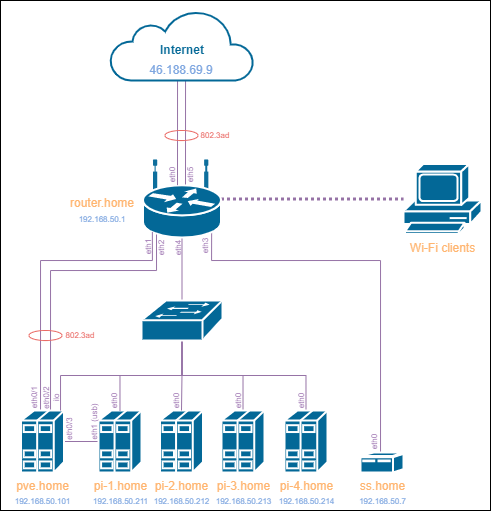

## 03-sysadmin-08-net
1. Подключитесь к публичному маршрутизатору в интернет. Найдите маршрут к вашему публичному IP
```
telnet route-views.routeviews.org
Username: rviews
show ip route x.x.x.x/32
show bgp x.x.x.x/32
```
```bash
route-views>show ip route 46.188.69.9
Routing entry for 46.188.0.0/17
  Known via "bgp 6447", distance 20, metric 0
  Tag 3267, type external
  Last update from 194.85.40.15 2d11h ago
  Routing Descriptor Blocks:
  * 194.85.40.15, from 194.85.40.15, 2d11h ago
      Route metric is 0, traffic share count is 1
      AS Hops 3
      Route tag 3267
      MPLS label: none
route-views>show bgp 46.188.69.9
BGP routing table entry for 46.188.0.0/17, version 2473718508
Paths: (23 available, best #3, table default)
  Not advertised to any peer
  Refresh Epoch 1
  3356 12389 39153 39153 8334
    4.68.4.46 from 4.68.4.46 (4.69.184.201)
      Origin IGP, metric 0, localpref 100, valid, external
      Community: 3356:2 3356:22 3356:100 3356:123 3356:501 3356:903 3356:2065 39153:10 39153:510
      path 7FE0C08D7138 RPKI State not found
      rx pathid: 0, tx pathid: 0
  Refresh Epoch 1
  3549 3356 12389 39153 39153 8334
    208.51.134.254 from 208.51.134.254 (67.16.168.191)
      Origin IGP, metric 0, localpref 100, valid, external
      Community: 3356:2 3356:22 3356:100 3356:123 3356:501 3356:903 3356:2065 3549:2581 3549:30840 39153:10 39153:510
      path 7FE0DB844290 RPKI State not found
      rx pathid: 0, tx pathid: 0
  Refresh Epoch 1
  3267 39153 8334
    194.85.40.15 from 194.85.40.15 (185.141.126.1)
      Origin incomplete, metric 0, localpref 100, valid, external, best
      path 7FE1245DC8F0 RPKI State not found
      rx pathid: 0, tx pathid: 0x0
  Refresh Epoch 1
  57866 28917 39153 8334
    37.139.139.17 from 37.139.139.17 (37.139.139.17)
      Origin IGP, metric 0, localpref 100, valid, external
      Community: 0:6939 0:16276 28917:2000 28917:5310 28917:5320 39153:10 39153:509 57866:200 65102:41441 65103:1 65104:31
      unknown transitive attribute: flag 0xE0 type 0x20 length 0x30
        value 0000 E20A 0000 0065 0000 00C8 0000 E20A
              0000 0066 0000 A1E1 0000 E20A 0000 0067
              0000 0001 0000 E20A 0000 0068 0000 001F

      path 7FE0C368F140 RPKI State not found
      rx pathid: 0, tx pathid: 0
  Refresh Epoch 1
  53767 174 12389 39153 39153 8334
    162.251.163.2 from 162.251.163.2 (162.251.162.3)
      Origin incomplete, localpref 100, valid, external
      Community: 174:21101 174:22005 53767:5000
      path 7FE020B30BE8 RPKI State not found
      rx pathid: 0, tx pathid: 0
  Refresh Epoch 1
  101 3356 12389 39153 39153 8334
    209.124.176.223 from 209.124.176.223 (209.124.176.223)
      Origin IGP, localpref 100, valid, external
      Community: 101:20100 101:20110 101:22100 3356:2 3356:22 3356:100 3356:123 3356:501 3356:903 3356:2065 39153:10 39153:510
      Extended Community: RT:101:22100
      path 7FE0DC6007B0 RPKI State not found
      rx pathid: 0, tx pathid: 0
  Refresh Epoch 1
  3333 1257 28917 39153 8334
    193.0.0.56 from 193.0.0.56 (193.0.0.56)
      Origin incomplete, localpref 100, valid, external
      Community: 1257:50 1257:51 1257:2000 1257:3428 1257:4103 28917:2000 28917:5310 28917:5320 39153:10 39153:509
      path 7FE0AE7821A0 RPKI State not found
      rx pathid: 0, tx pathid: 0
  Refresh Epoch 1
  852 3257 28917 39153 8334
    154.11.12.212 from 154.11.12.212 (96.1.209.43)
      Origin IGP, metric 0, localpref 100, valid, external
      path 7FE149062A18 RPKI State not found
      rx pathid: 0, tx pathid: 0
  Refresh Epoch 1
  49788 12552 28917 39153 8334
    91.218.184.60 from 91.218.184.60 (91.218.184.60)
      Origin incomplete, localpref 100, valid, external
      Community: 12552:12000 12552:12600 12552:12601 12552:22000
      Extended Community: 0x43:100:1
      path 7FE084103CF8 RPKI State not found
      rx pathid: 0, tx pathid: 0
  Refresh Epoch 1
  7018 3257 28917 39153 8334
    12.0.1.63 from 12.0.1.63 (12.0.1.63)
      Origin incomplete, localpref 100, valid, external
      Community: 7018:5000 7018:37232
      path 7FE0C34357B8 RPKI State not found
      rx pathid: 0, tx pathid: 0
  Refresh Epoch 1
  4901 6079 3257 28917 39153 8334
    162.250.137.254 from 162.250.137.254 (162.250.137.254)
      Origin incomplete, localpref 100, valid, external
      Community: 65000:10100 65000:10300 65000:10400
      path 7FE133223518 RPKI State not found
      rx pathid: 0, tx pathid: 0
  Refresh Epoch 1
  8283 28917 39153 8334
    94.142.247.3 from 94.142.247.3 (94.142.247.3)
      Origin incomplete, metric 0, localpref 100, valid, external
      Community: 0:6939 0:16276 8283:1 8283:101 28917:2000 28917:5310 28917:5320 39153:10 39153:509
      unknown transitive attribute: flag 0xE0 type 0x20 length 0x18
        value 0000 205B 0000 0000 0000 0001 0000 205B
              0000 0005 0000 0001
      path 7FE15F9C64B8 RPKI State not found
      rx pathid: 0, tx pathid: 0
  Refresh Epoch 1
  20130 6939 28917 39153 8334
    140.192.8.16 from 140.192.8.16 (140.192.8.16)
      Origin IGP, localpref 100, valid, external
      path 7FE0140C8398 RPKI State not found
      rx pathid: 0, tx pathid: 0
  Refresh Epoch 1
  20912 3257 28917 39153 8334
    212.66.96.126 from 212.66.96.126 (212.66.96.126)
      Origin incomplete, localpref 100, valid, external
      Community: 3257:4000 3257:8092 3257:50001 3257:50111 3257:54800 3257:54801 20912:65004
      path 7FE11C0FCAA0 RPKI State not found
      rx pathid: 0, tx pathid: 0
  Refresh Epoch 1
  7660 2516 12389 39153 39153 8334
    203.181.248.168 from 203.181.248.168 (203.181.248.168)
      Origin incomplete, localpref 100, valid, external
      Community: 2516:1050 7660:9003
      path 7FE01098EEC8 RPKI State not found
      rx pathid: 0, tx pathid: 0
  Refresh Epoch 1
  3561 3910 3356 12389 39153 39153 8334
    206.24.210.80 from 206.24.210.80 (206.24.210.80)
      Origin IGP, localpref 100, valid, external
      path 7FE17AB40288 RPKI State not found
      rx pathid: 0, tx pathid: 0
  Refresh Epoch 1
  701 1273 12389 39153 39153 8334
    137.39.3.55 from 137.39.3.55 (137.39.3.55)
      Origin incomplete, localpref 100, valid, external
      path 7FE0DCB3E3B8 RPKI State not found
      rx pathid: 0, tx pathid: 0
  Refresh Epoch 1
  19214 3257 28917 39153 8334
    208.74.64.40 from 208.74.64.40 (208.74.64.40)
      Origin incomplete, localpref 100, valid, external
      Community: 3257:4000 3257:8092 3257:50001 3257:50111 3257:54800 3257:54801
      path 7FE03DA579D0 RPKI State not found
      rx pathid: 0, tx pathid: 0
  Refresh Epoch 1
  6939 28917 39153 8334
    64.71.137.241 from 64.71.137.241 (216.218.252.164)
      Origin IGP, localpref 100, valid, external
      path 7FE0BE705F98 RPKI State not found
      rx pathid: 0, tx pathid: 0
  Refresh Epoch 1
  1351 6939 28917 39153 8334
    132.198.255.253 from 132.198.255.253 (132.198.255.253)
      Origin IGP, localpref 100, valid, external
      path 7FE02DCA9C00 RPKI State not found
      rx pathid: 0, tx pathid: 0
  Refresh Epoch 1
  3303 28917 39153 8334
    217.192.89.50 from 217.192.89.50 (138.187.128.158)
      Origin incomplete, localpref 100, valid, external
      Community: 3303:1004 3303:1006 3303:1030 3303:3056 28917:2000 28917:5310 28917:5320 39153:10 39153:509
      path 7FE14215C1A8 RPKI State not found
      rx pathid: 0, tx pathid: 0
  Refresh Epoch 3
  2497 3257 28917 39153 8334
    202.232.0.2 from 202.232.0.2 (58.138.96.254)
      Origin incomplete, localpref 100, valid, external
      path 7FE0C2A1BC50 RPKI State not found
      rx pathid: 0, tx pathid: 0
  Refresh Epoch 1
  3257 28917 39153 8334
    89.149.178.10 from 89.149.178.10 (213.200.83.26)
      Origin incomplete, metric 10, localpref 100, valid, external
      Community: 3257:4000 3257:8092 3257:50001 3257:50111 3257:54800 3257:54801
      path 7FE0BA1187D0 RPKI State not found
      rx pathid: 0, tx pathid: 0
```
2. Создайте dummy0 интерфейс в Ubuntu. Добавьте несколько статических маршрутов. Проверьте таблицу маршрутизации.
```bash
❯ cat /etc/network/interfaces.d/dummy0
auto dummy0
iface dummy0 inet static
        address 172.0.0.2/32
        pre-up ip link add dummy0 type dummy
        post-down ip link del dummy0
❯ ip route add 10.0.0.0/24 via 172.0.0.2
❯ ip route add 10.0.2.0/24 dev dummy0
❯ ip -br route
...
10.0.0.0/24 via 172.0.0.2 dev dummy0
10.0.2.0/24 dev dummy0 scope link
...
```
3. Проверьте открытые TCP порты в Ubuntu, какие протоколы и приложения используют эти порты? Приведите несколько примеров.
```bash
❯ netstat -tlpn
...
# SSH-сервер
tcp        0      0 0.0.0.0:22              0.0.0.0:*               LISTEN      sshd
...
# Samba-сервер
tcp        0      0 0.0.0.0:139             0.0.0.0:*               LISTEN      smbd
tcp        0      0 0.0.0.0:445             0.0.0.0:*               LISTEN      smbd
...
# Этот и еще несколько десятков других портов, занятых вывернутыми через них docker-контейнерами
tcp        0      0 0.0.0.0:8000            0.0.0.0:*               LISTEN      docker-proxy
...
# Веб-интерфейс гипервизора Proxmox
tcp6       0      0 :::8006                 :::*                    LISTEN      pveproxy
...
```
4. Проверьте используемые UDP сокеты в Ubuntu, какие протоколы и приложения используют эти порты?
```bash
❯ netstat -ulpn
...
# На самом деле это порт завернутого в контейнер dnsmasq'а
udp        0      0 0.0.0.0:53              0.0.0.0:*                           docker-proxy
...
# А это порт DLNA сервера, протокол SSDP для упрощения обнаружения клиентами (SMART-тв, например)
udp        0      0 0.0.0.0:1900            0.0.0.0:*                           jellyfin
...
```
5. Используя diagrams.net, создайте L3 диаграмму вашей домашней сети или любой другой сети, с которой вы работали. 

6. [*] Установите Nginx, настройте в режиме балансировщика TCP или UDP.

7. [*] Установите bird2, настройте динамический протокол маршрутизации RIP.
8. [*] Установите Netbox, создайте несколько IP префиксов, используя curl проверьте работу API.
---