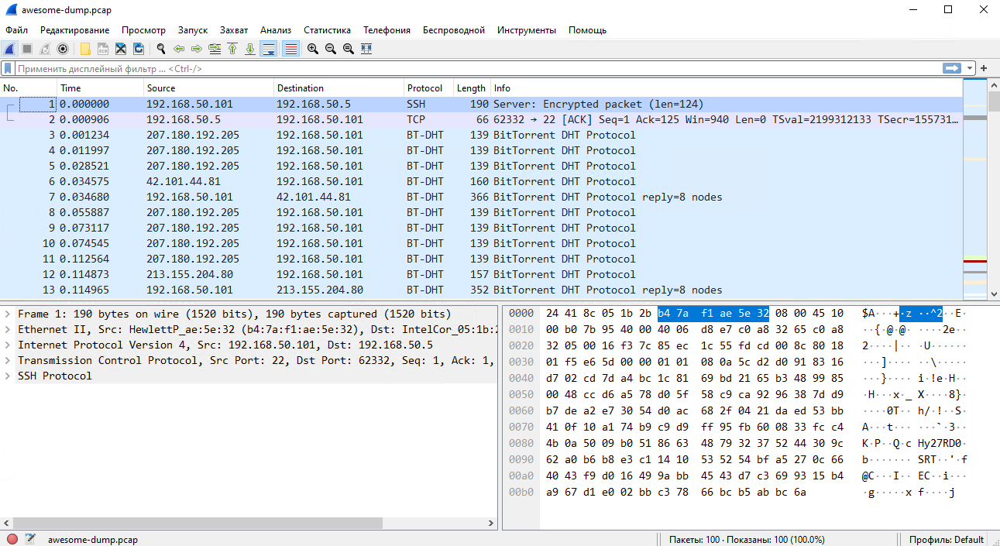

## 03-sysadmin-09-security
1. Установите Bitwarden плагин для браузера. Зарегестрируйтесь и сохраните несколько паролей.
```bash
#По удачному стечению обстоятельств как раз разворачивал у себя в компании опенсорсную реализацию Vaultwarden, которая прекрасно работает со всеми клиентами Bitwarden.
root@vault1-ti:~/consul# docker ps -a
CONTAINER ID   IMAGE                                                     STATUS         PORTS		NAMES
8ddf3f6710da   docker-hub.nexus.infra/consul:1.10.2                      Up 13 months   			vault-consul-agent
72629886dcfa   docker-hub.nexus.infra/consul:1.10.2                      Up 13 months   			vault-consul-server1
36627d5bafa3   docker-hub.nexus.infra/hashicorp/counting-service:0.0.2   Up 13 months   9001/tcp	weasel
```
2. Установите Google authenticator на мобильный телефон. Настройте вход в Bitwarden акаунт через Google authenticator OTP.
```bash
Уже использую для входа в Bitwarden.
```
3. Установите apache2, сгенерируйте самоподписанный сертификат, настройте тестовый сайт для работы по HTTPS.
```bash
❯ openssl req -x509 -nodes -days 365 -newkey rsa:2048 -keyout /etc/ssl/private/apache-selfsigned.key -out /etc/ssl/certs/apache-selfsigned.crt
❯ cat /etc/apache2/sites-available/my-awesome-site.conf
...
	SSLEngine on
	SSLCertificateFile /etc/ssl/certs/apache-selfsigned.crt
	SSLCertificateKeyFile /etc/ssl/private/apache-selfsigned.key
...
```
4. Проверьте на TLS уязвимости произвольный сайт в интернете (кроме сайтов МВД, ФСБ, МинОбр, НацБанк, РосКосмос, РосАтом, РосНАНО и любых госкомпаний, объектов КИИ, ВПК ... и тому подобное).
```bash
 Start 2022-10-23 23:25:48        -->> 172.67.69.48:443 (awatera.com) <<--

 Further IP addresses:   104.26.3.128 104.26.2.128 108.162.192.81 172.64.32.81 173.245.58.81 173.245.59.243 108.162.193.243 172.64.33.243 2a06:98c1:3123:e000:: 2a06:98c1:3122:e000::
                         2a06:98c1:50::ac40:2051 2606:4700:50::adf5:3a51 2803:f800:50::6ca2:c051 2803:f800:50::6ca2:c1f3 2a06:98c1:50::ac40:21f3 2606:4700:58::adf5:3bf3
 rDNS (172.67.69.48):    --
 Service detected:       HTTP


 Testing protocols via sockets except NPN+ALPN

 SSLv2      not offered (OK)
 SSLv3      not offered (OK)
 TLS 1      offered (deprecated)
 TLS 1.1    offered (deprecated)
 TLS 1.2    offered (OK)
 TLS 1.3    offered (OK): final
 NPN/SPDY   not offered
 ALPN/HTTP2 h2, http/1.1 (offered)

 Testing cipher categories

 NULL ciphers (no encryption)                      not offered (OK)
 Anonymous NULL Ciphers (no authentication)        not offered (OK)
 Export ciphers (w/o ADH+NULL)                     not offered (OK)
 LOW: 64 Bit + DES, RC[2,4], MD5 (w/o export)      not offered (OK)
 Triple DES Ciphers / IDEA                         offered
 Obsoleted CBC ciphers (AES, ARIA etc.)            offered
 Strong encryption (AEAD ciphers) with no FS       offered (OK)
 Forward Secrecy strong encryption (AEAD ciphers)  offered (OK)


 Testing server's cipher preferences

Hexcode  Cipher Suite Name (OpenSSL)       KeyExch.   Encryption  Bits     Cipher Suite Name (IANA/RFC)
-----------------------------------------------------------------------------------------------------------------------------
SSLv2
 -
SSLv3
 -
TLSv1 (server order)
 xc013   ECDHE-RSA-AES128-SHA              ECDH 253   AES         128      TLS_ECDHE_RSA_WITH_AES_128_CBC_SHA
 x2f     AES128-SHA                        RSA        AES         128      TLS_RSA_WITH_AES_128_CBC_SHA
 xc014   ECDHE-RSA-AES256-SHA              ECDH 253   AES         256      TLS_ECDHE_RSA_WITH_AES_256_CBC_SHA
 x35     AES256-SHA                        RSA        AES         256      TLS_RSA_WITH_AES_256_CBC_SHA
 x0a     DES-CBC3-SHA                      RSA        3DES        168      TLS_RSA_WITH_3DES_EDE_CBC_SHA
TLSv1.1 (server order)
 xc013   ECDHE-RSA-AES128-SHA              ECDH 253   AES         128      TLS_ECDHE_RSA_WITH_AES_128_CBC_SHA
 x2f     AES128-SHA                        RSA        AES         128      TLS_RSA_WITH_AES_128_CBC_SHA
 xc014   ECDHE-RSA-AES256-SHA              ECDH 253   AES         256      TLS_ECDHE_RSA_WITH_AES_256_CBC_SHA
 x35     AES256-SHA                        RSA        AES         256      TLS_RSA_WITH_AES_256_CBC_SHA
TLSv1.2 (server order -- server prioritizes ChaCha ciphers when preferred by clients)
 xc02b   ECDHE-ECDSA-AES128-GCM-SHA256     ECDH 253   AESGCM      128      TLS_ECDHE_ECDSA_WITH_AES_128_GCM_SHA256
 xcc14   ECDHE-ECDSA-CHACHA20-POLY1305-OLD ECDH 253   ChaCha20    256      TLS_ECDHE_ECDSA_WITH_CHACHA20_POLY1305_SHA256_OLD
 xcca9   ECDHE-ECDSA-CHACHA20-POLY1305     ECDH 253   ChaCha20    256      TLS_ECDHE_ECDSA_WITH_CHACHA20_POLY1305_SHA256
 xc009   ECDHE-ECDSA-AES128-SHA            ECDH 253   AES         128      TLS_ECDHE_ECDSA_WITH_AES_128_CBC_SHA
 xc02c   ECDHE-ECDSA-AES256-GCM-SHA384     ECDH 253   AESGCM      256      TLS_ECDHE_ECDSA_WITH_AES_256_GCM_SHA384
 xc00a   ECDHE-ECDSA-AES256-SHA            ECDH 253   AES         256      TLS_ECDHE_ECDSA_WITH_AES_256_CBC_SHA
 xc023   ECDHE-ECDSA-AES128-SHA256         ECDH 253   AES         128      TLS_ECDHE_ECDSA_WITH_AES_128_CBC_SHA256
 xc024   ECDHE-ECDSA-AES256-SHA384         ECDH 253   AES         256      TLS_ECDHE_ECDSA_WITH_AES_256_CBC_SHA384
 xc02f   ECDHE-RSA-AES128-GCM-SHA256       ECDH 253   AESGCM      128      TLS_ECDHE_RSA_WITH_AES_128_GCM_SHA256
 xcc13   ECDHE-RSA-CHACHA20-POLY1305-OLD   ECDH 253   ChaCha20    256      TLS_ECDHE_RSA_WITH_CHACHA20_POLY1305_SHA256_OLD
 xcca8   ECDHE-RSA-CHACHA20-POLY1305       ECDH 253   ChaCha20    256      TLS_ECDHE_RSA_WITH_CHACHA20_POLY1305_SHA256
 xc013   ECDHE-RSA-AES128-SHA              ECDH 253   AES         128      TLS_ECDHE_RSA_WITH_AES_128_CBC_SHA
 x9c     AES128-GCM-SHA256                 RSA        AESGCM      128      TLS_RSA_WITH_AES_128_GCM_SHA256
 x2f     AES128-SHA                        RSA        AES         128      TLS_RSA_WITH_AES_128_CBC_SHA
 xc030   ECDHE-RSA-AES256-GCM-SHA384       ECDH 253   AESGCM      256      TLS_ECDHE_RSA_WITH_AES_256_GCM_SHA384
 xc014   ECDHE-RSA-AES256-SHA              ECDH 253   AES         256      TLS_ECDHE_RSA_WITH_AES_256_CBC_SHA
 x9d     AES256-GCM-SHA384                 RSA        AESGCM      256      TLS_RSA_WITH_AES_256_GCM_SHA384
 x35     AES256-SHA                        RSA        AES         256      TLS_RSA_WITH_AES_256_CBC_SHA
 xc027   ECDHE-RSA-AES128-SHA256           ECDH 253   AES         128      TLS_ECDHE_RSA_WITH_AES_128_CBC_SHA256
 x3c     AES128-SHA256                     RSA        AES         128      TLS_RSA_WITH_AES_128_CBC_SHA256
 xc028   ECDHE-RSA-AES256-SHA384           ECDH 253   AES         256      TLS_ECDHE_RSA_WITH_AES_256_CBC_SHA384
 x3d     AES256-SHA256                     RSA        AES         256      TLS_RSA_WITH_AES_256_CBC_SHA256
TLSv1.3 (no server order, thus listed by strength)
 x1302   TLS_AES_256_GCM_SHA384            ECDH 253   AESGCM      256      TLS_AES_256_GCM_SHA384
 x1303   TLS_CHACHA20_POLY1305_SHA256      ECDH 253   ChaCha20    256      TLS_CHACHA20_POLY1305_SHA256
 x1301   TLS_AES_128_GCM_SHA256            ECDH 253   AESGCM      128      TLS_AES_128_GCM_SHA256

 Has server cipher order?     yes (OK) -- only for < TLS 1.3
 Negotiated protocol          TLSv1.3
 Negotiated cipher            TLS_AES_256_GCM_SHA384, 253 bit ECDH (X25519)

 Testing robust forward secrecy (FS) -- omitting Null Authentication/Encryption, 3DES, RC4

 FS is offered (OK)           TLS_AES_256_GCM_SHA384 TLS_CHACHA20_POLY1305_SHA256 ECDHE-ECDSA-CHACHA20-POLY1305-OLD ECDHE-RSA-CHACHA20-POLY1305-OLD ECDHE-RSA-AES256-GCM-SHA384
                              ECDHE-ECDSA-AES256-GCM-SHA384 ECDHE-RSA-AES256-SHA384 ECDHE-ECDSA-AES256-SHA384 ECDHE-RSA-AES256-SHA ECDHE-ECDSA-AES256-SHA
                              ECDHE-ECDSA-CHACHA20-POLY1305 ECDHE-RSA-CHACHA20-POLY1305 TLS_AES_128_GCM_SHA256 ECDHE-RSA-AES128-GCM-SHA256 ECDHE-ECDSA-AES128-GCM-SHA256
                              ECDHE-RSA-AES128-SHA256 ECDHE-ECDSA-AES128-SHA256 ECDHE-RSA-AES128-SHA ECDHE-ECDSA-AES128-SHA
 Elliptic curves offered:     prime256v1 secp384r1 secp521r1 X25519


 Testing server defaults (Server Hello)

 TLS extensions (standard)    "server name/#0" "renegotiation info/#65281" "EC point formats/#11" "session ticket/#35" "next protocol/#13172" "key share/#51" "supported versions/#43"
                              "extended master secret/#23" "application layer protocol negotiation/#16" "compress_certificate/#27"
 Session Ticket RFC 5077 hint 64800 seconds, session tickets keys seems to be rotated < daily
 SSL Session ID support       yes
 Session Resumption           Tickets: yes, ID: no
 TLS clock skew               +1 sec from localtime
 Certificate Compression      0002/Brotli
 Client Authentication        none

  Server Certificate #1
   Signature Algorithm          SHA256 with RSA
   Server key size              RSA 2048 bits (exponent is 65537)
   Server key usage             Digital Signature, Key Encipherment
   Server extended key usage    TLS Web Server Authentication, TLS Web Client Authentication
   Serial                       0A6731FE2B814D6A3E222181AC8022D2 (OK: length 16)
   Fingerprints                 SHA1 F440801835B6D4913F52508EA05D13E61719BC13
                                SHA256 E980C250B7C873A6B0AA7C0A11F5DBE23014DE154528785C9CA9F01E70D970D6
   Common Name (CN)             sni.cloudflaressl.com  (request w/o SNI didn't succeed)
   subjectAltName (SAN)         *.awatera.com sni.cloudflaressl.com awatera.com
   Trust (hostname)             Ok via SAN (SNI mandatory)
   Chain of trust               Ok
   EV cert (experimental)       no
   Certificate Validity (UTC)   204 >= 60 days (2022-05-15 00:00 --> 2023-05-15 23:59)
   ETS/"eTLS", visibility info  not present
   Certificate Revocation List  http://crl3.digicert.com/CloudflareIncRSACA-2.crl
                                http://crl4.digicert.com/CloudflareIncRSACA-2.crl
   OCSP URI                     http://ocsp.digicert.com
   OCSP stapling                not offered
   OCSP must staple extension   --
   DNS CAA RR (experimental)    not offered
   Certificate Transparency     yes (certificate extension)
   Certificates provided        2
   Issuer                       Cloudflare Inc RSA CA-2 (Cloudflare, Inc. from US)
   Intermediate cert validity   #1: ok > 40 days (2024-12-31 23:59). Cloudflare Inc RSA CA-2 <-- Baltimore CyberTrust Root
   Intermediate Bad OCSP (exp.) Ok

  Server Certificate #2
   Signature Algorithm          ECDSA with SHA256
   Server key size              EC 256 bits (curve P-256)
   Server key usage             Digital Signature
   Server extended key usage    TLS Web Server Authentication, TLS Web Client Authentication
   Serial                       0A717660C76724F3D3A3D8B15670339A (OK: length 16)
   Fingerprints                 SHA1 040FB009E527527CB4FC15053E06003589EEE96C
                                SHA256 424104AD8CBC528CBE128E97D0D96022AC63CD0B79E20028618ED8625745AF22
   Common Name (CN)             sni.cloudflaressl.com  (request w/o SNI didn't succeed, usual for EC certificates)
   subjectAltName (SAN)         *.awatera.com sni.cloudflaressl.com awatera.com
   Trust (hostname)             Ok via SAN (SNI mandatory)
   Chain of trust               Ok
   EV cert (experimental)       no
   Certificate Validity (UTC)   204 >= 60 days (2022-05-15 00:00 --> 2023-05-15 23:59)
   ETS/"eTLS", visibility info  not present
   Certificate Revocation List  http://crl3.digicert.com/CloudflareIncECCCA-3.crl
                                http://crl4.digicert.com/CloudflareIncECCCA-3.crl
   OCSP URI                     http://ocsp.digicert.com
   OCSP stapling                not offered
   OCSP must staple extension   --
   DNS CAA RR (experimental)    not offered
   Certificate Transparency     yes (certificate extension)
   Certificates provided        2
   Issuer                       Cloudflare Inc ECC CA-3 (Cloudflare, Inc. from US)
   Intermediate cert validity   #1: ok > 40 days (2024-12-31 23:59). Cloudflare Inc ECC CA-3 <-- Baltimore CyberTrust Root
   Intermediate Bad OCSP (exp.) Ok


 Testing HTTP header response @ "/"

 HTTP Status Code             200 OK
 HTTP clock skew              +1 sec from localtime
 Strict Transport Security    not offered
 Public Key Pinning           --
 Server banner                cloudflare
 Application banner           --
 Cookie(s)                    1 issued: NOT secure, NOT HttpOnly
 Security headers             --
 Reverse Proxy banner         --


 Testing vulnerabilities

 Heartbleed (CVE-2014-0160)                not vulnerable (OK), no heartbeat extension
 CCS (CVE-2014-0224)                       not vulnerable (OK)
 Ticketbleed (CVE-2016-9244), experiment.  not vulnerable (OK), no session tickets
 ROBOT                                     not vulnerable (OK)
 Secure Renegotiation (RFC 5746)           OpenSSL handshake didn't succeed
 Secure Client-Initiated Renegotiation     not vulnerable (OK)
 CRIME, TLS (CVE-2012-4929)                not vulnerable (OK)
 BREACH (CVE-2013-3587)                    potentially NOT ok, "br gzip" HTTP compression detected. - only supplied "/" tested
                                           Can be ignored for static pages or if no secrets in the page
 POODLE, SSL (CVE-2014-3566)               not vulnerable (OK), no SSLv3 support
 TLS_FALLBACK_SCSV (RFC 7507)              Downgrade attack prevention supported (OK)
 SWEET32 (CVE-2016-2183, CVE-2016-6329)    VULNERABLE, uses 64 bit block ciphers
 FREAK (CVE-2015-0204)                     not vulnerable (OK)
 DROWN (CVE-2016-0800, CVE-2016-0703)      not vulnerable on this host and port (OK)
                                           make sure you don't use this certificate elsewhere with SSLv2 enabled services, see
                                           https://search.censys.io/search?resource=hosts&virtual_hosts=INCLUDE&q=E980C250B7C873A6B0AA7C0A11F5DBE23014DE154528785C9CA9F01E70D970D6
 LOGJAM (CVE-2015-4000), experimental      not vulnerable (OK): no DH EXPORT ciphers, no DH key detected with <= TLS 1.2
 BEAST (CVE-2011-3389)                     TLS1: ECDHE-RSA-AES128-SHA AES128-SHA ECDHE-RSA-AES256-SHA AES256-SHA DES-CBC3-SHA
                                           VULNERABLE -- but also supports higher protocols  TLSv1.1 TLSv1.2 (likely mitigated)
 LUCKY13 (CVE-2013-0169), experimental     potentially VULNERABLE, uses cipher block chaining (CBC) ciphers with TLS. Check patches
 Winshock (CVE-2014-6321), experimental    not vulnerable (OK)
 RC4 (CVE-2013-2566, CVE-2015-2808)        no RC4 ciphers detected (OK)


 Running client simulations (HTTP) via sockets

 Browser                      Protocol  Cipher Suite Name (OpenSSL)       Forward Secrecy
------------------------------------------------------------------------------------------------
 Android 6.0                  TLSv1.2   ECDHE-ECDSA-CHACHA20-POLY1305-OLD 256 bit ECDH (P-256)
 Android 7.0 (native)         TLSv1.2   ECDHE-ECDSA-AES128-GCM-SHA256     256 bit ECDH (P-256)
 Android 8.1 (native)         TLSv1.2   ECDHE-ECDSA-AES128-GCM-SHA256     253 bit ECDH (X25519)
 Android 9.0 (native)         TLSv1.3   TLS_AES_128_GCM_SHA256            253 bit ECDH (X25519)
 Android 10.0 (native)        TLSv1.3   TLS_AES_128_GCM_SHA256            253 bit ECDH (X25519)
 Android 11 (native)          TLSv1.3   TLS_AES_128_GCM_SHA256            253 bit ECDH (X25519)
 Android 12 (native)          TLSv1.3   TLS_AES_128_GCM_SHA256            253 bit ECDH (X25519)
 Chrome 79 (Win 10)           TLSv1.3   TLS_AES_128_GCM_SHA256            253 bit ECDH (X25519)
 Chrome 101 (Win 10)          TLSv1.3   TLS_AES_128_GCM_SHA256            253 bit ECDH (X25519)
 Firefox 66 (Win 8.1/10)      TLSv1.3   TLS_AES_128_GCM_SHA256            253 bit ECDH (X25519)
 Firefox 100 (Win 10)         TLSv1.3   TLS_AES_128_GCM_SHA256            253 bit ECDH (X25519)
 IE 6 XP                      No connection
 IE 8 Win 7                   TLSv1.0   ECDHE-RSA-AES128-SHA              256 bit ECDH (P-256)
 IE 8 XP                      No connection
 IE 11 Win 7                  TLSv1.2   ECDHE-ECDSA-AES128-GCM-SHA256     256 bit ECDH (P-256)
 IE 11 Win 8.1                TLSv1.2   ECDHE-ECDSA-AES128-GCM-SHA256     256 bit ECDH (P-256)
 IE 11 Win Phone 8.1          TLSv1.2   ECDHE-ECDSA-AES128-GCM-SHA256     256 bit ECDH (P-256)
 IE 11 Win 10                 TLSv1.2   ECDHE-ECDSA-AES128-GCM-SHA256     256 bit ECDH (P-256)
 Edge 15 Win 10               TLSv1.2   ECDHE-ECDSA-AES128-GCM-SHA256     253 bit ECDH (X25519)
 Edge 101 Win 10 21H2         TLSv1.3   TLS_AES_128_GCM_SHA256            253 bit ECDH (X25519)
 Safari 12.1 (iOS 12.2)       TLSv1.3   TLS_CHACHA20_POLY1305_SHA256      253 bit ECDH (X25519)
 Safari 13.0 (macOS 10.14.6)  TLSv1.3   TLS_CHACHA20_POLY1305_SHA256      253 bit ECDH (X25519)
 Safari 15.4 (macOS 12.3.1)   TLSv1.3   TLS_AES_128_GCM_SHA256            253 bit ECDH (X25519)
 Java 7u25                    TLSv1.0   ECDHE-RSA-AES128-SHA              256 bit ECDH (P-256)
 Java 8u161                   TLSv1.2   ECDHE-ECDSA-AES128-GCM-SHA256     256 bit ECDH (P-256)
 Java 11.0.2 (OpenJDK)        TLSv1.3   TLS_AES_128_GCM_SHA256            256 bit ECDH (P-256)
 Java 17.0.3 (OpenJDK)        TLSv1.3   TLS_AES_256_GCM_SHA384            253 bit ECDH (X25519)
 go 1.17.8                    TLSv1.3   TLS_AES_128_GCM_SHA256            253 bit ECDH (X25519)
 LibreSSL 2.8.3 (Apple)       TLSv1.2   ECDHE-ECDSA-CHACHA20-POLY1305     253 bit ECDH (X25519)
 OpenSSL 1.0.2e               TLSv1.2   ECDHE-ECDSA-AES128-GCM-SHA256     256 bit ECDH (P-256)
 OpenSSL 1.1.0l (Debian)      TLSv1.2   ECDHE-ECDSA-CHACHA20-POLY1305     253 bit ECDH (X25519)
 OpenSSL 1.1.1d (Debian)      TLSv1.3   TLS_AES_256_GCM_SHA384            253 bit ECDH (X25519)
 OpenSSL 3.0.3 (git)          TLSv1.3   TLS_AES_256_GCM_SHA384            253 bit ECDH (X25519)
 Apple Mail (16.0)            TLSv1.2   ECDHE-ECDSA-AES128-GCM-SHA256     256 bit ECDH (P-256)
 Thunderbird (91.9)           TLSv1.3   TLS_AES_128_GCM_SHA256            253 bit ECDH (X25519)


 Rating (experimental)

 Rating specs (not complete)  SSL Labs's 'SSL Server Rating Guide' (version 2009q from 2020-01-30)
 Specification documentation  https://github.com/ssllabs/research/wiki/SSL-Server-Rating-Guide
 Protocol Support (weighted)  95 (28)
 Key Exchange     (weighted)  90 (27)
 Cipher Strength  (weighted)  90 (36)
 Final Score                  91
 Overall Grade                B
 Grade cap reasons            Grade capped to B. TLS 1.1 offered
                              Grade capped to B. TLS 1.0 offered
                              Grade capped to A. HSTS is not offered

 Done 2022-10-23 23:27:35 [ 109s] -->> 172.67.69.48:443 (awatera.com) <<--
```
5. Установите на Ubuntu ssh сервер, сгенерируйте новый приватный ключ. Скопируйте свой публичный ключ на другой сервер. Подключитесь к серверу по SSH-ключу.
```bash
❯ sudo apt-get install openssh-server -y
❯ ssh-keygen
...
❯ ssh-copy-id firstman@my-awesome-server
❯ ssh firstman@my-awesome-server
```
6. Переименуйте файлы ключей из задания 5. Настройте файл конфигурации SSH клиента, так чтобы вход на удаленный сервер осуществлялся по имени сервера.
```bash
❯ cat ~/.ssh/config
...
Host my-awesome-server
	User firstman
	IdentityFile ~/.ssh/firstman_rsa
...
❯ ssh my-awesome-server
```
7. Соберите дамп трафика утилитой tcpdump в формате pcap, 100 пакетов. Откройте файл pcap в Wireshark.
```bash
❯ tcpdump -i vmbr0 -c 100 -w awesome-dump.pcap
```


8. [*] Просканируйте хост scanme.nmap.org. Какие сервисы запущены?
9. [*] Установите и настройте фаервол ufw на web-сервер из задания 3. Откройте доступ снаружи только к портам 22,80,443
