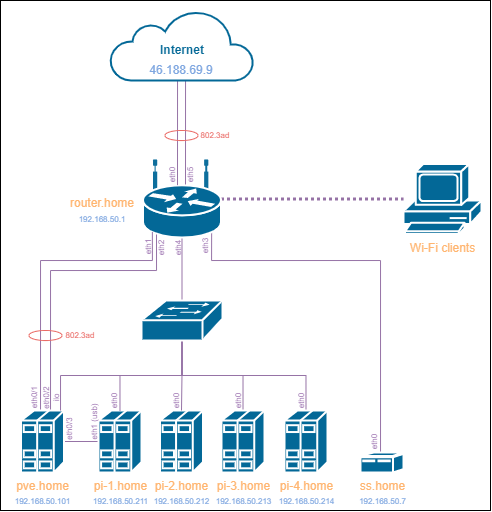

## Оглавление

* [03-sysadmin-01-terminal](#03-sysadmin-01-terminal)
* [03-sysadmin-02-terminal](#03-sysadmin-02-terminal)
* [03-sysadmin-03-os](#03-sysadmin-03-os)
* [03-sysadmin-04-os](#03-sysadmin-04-os)
* [03-sysadmin-05-fs](#03-sysadmin-05-fs)
* [03-sysadmin-06-net](#03-sysadmin-06-net)
* [03-sysadmin-07-net](#03-sysadmin-07-net)
* [03-sysadmin-08-net](#03-sysadmin-08-net)
* [03-sysadmin-09-security](#03-sysadmin-09-security)
---

## 03-sysadmin-01-terminal
1-7. У меня дома сервер с Proxmox на борту, так что ДЗ выполняю в виртуалке на нём.

8. Ознакомиться с разделами `man bash`, почитать о настройках самого bash:
* какой переменной можно задать длину журнала `history`, и на какой строчке manual это описывается?

  ```bash
  HISTSIZE (строка 862 в мануле)
  ```
* что делает директива `ignoreboth` в bash?

  ```bash
  Не сохранять команды начинающиеся с пробела и одинаковые команды, выполненные подряд (ignorespace + ignoredup)
  ```
  
9. В каких сценариях использования применимы скобки `{}` и на какой строчке `man bash` это описано?

  ```bash
  Это Brace Expansion (строка 1091 в мануле). Может использоваться для получения списка аргументов.
  echo {a..z} # алфавит
  echo {1..9} # последовательность
  echo {1..20..2} # инкремент в последовательности
  echo {a,b,c,d} # просто список
  ```

10. С учётом ответа на предыдущий вопрос, как создать однократным вызовом `touch` 100000 файлов? Получится ли аналогичным образом создать 300000? Если нет, то почему?

  ```bash
  touch {1..100000}.tmp
  ```
  
11.1 В man bash поищите по `/\[\[`. Что делает конструкция `[[ -d /tmp ]]`
  ```bash
  Двойные фигурные скобки - это расширение CONDITIONAL EXPRESSIONS. Данная конструкция проверяет существование папки /tmp.
  ```

11.2 Что же вернется в нашем случае, 0 или 1? Для проверки можно использовать команду echo $?
  ```bash
  В нашем случае вернется код 0, свидетельствующий о том, что папка существует.
  [[ -d /tmp ]]; echo $?
  0
  [[ -d /some_not_existing_dir ]]; echo $?
  1
  ```

12. Основываясь на знаниях о просмотре текущих (например, PATH) и установке новых переменных; командах, которые мы рассматривали, добейтесь в выводе type -a bash в виртуальной машине наличия первым пунктом в списке:
  ```bash
  bash is /tmp/new_path_directory/bash
  bash is /usr/local/bin/bash
  bash is /bin/bash
  ```
(прочие строки могут отличаться содержимым и порядком)

В качестве ответа приведите команды, которые позволили вам добиться указанного вывода или соответствующие скриншоты.

  ```bash
  mkdir -p /tmp/new_path_directory && touch /tmp/new_path_directory/bash
  PATH="/tmp/new_path_directory:$PATH"
  type -a bash
  ```

13. Чем отличается планирование команд с помощью `batch` и `at`?

  ```bash
  Обе являются частью пакета at.
  at - запуск команд в определённое время
  batch - выполнение команд когда загрузка системы ниже указанного значения (по дефолту 1.5)
  ```

14. Завершите работу виртуальной машины чтобы не расходовать ресурсы компьютера и/или батарею ноутбука.
---[
## 03-sysadmin-02-terminal

1. Какого типа команда `cd`? Попробуйте объяснить, почему она именно такого типа; опишите ход своих мыслей, если считаете что она могла бы быть другого типа.
  ```
  Это встроенная команда оболочки. Не будучи встроенной ей бы пришлось менять аттрибут родительского процесса.
  ```
2. Какая альтернатива без pipe команде `grep <some_string> <some_file> | wc -l`? `man grep` поможет в ответе на этот вопрос. Ознакомьтесь с [документом](http://www.smallo.ruhr.de/award.html) о других подобных некорректных вариантах использования pipe.
  ```
  grep <some_string> <some_file> -c
  ```
3. Какой процесс с PID `1` является родителем для всех процессов в вашей виртуальной машине Ubuntu 20.04?
  ```
  # Прародитель всех юзерспейсов
  /sbin/init
  ```
4. Как будет выглядеть команда, которая перенаправит вывод stderr `ls` на другую сессию терминала?
  ```
  # посмотреть номер терминала, в который хотим получить вывод
  tty
  /dev/pts/1
  # выполнить из другой сессии
  ls > /dev/pts/1
  ```
5. Получится ли одновременно передать команде файл на stdin и вывести ее stdout в другой файл? Приведите работающий пример.
  ```
  cat package_list.txt
  apt
  apt-utils
  apt-transport-https
  
  apt show $(<package_list.txt) > out.txt
  grep "utils" < out.txt > one_more_time.txt
  ```
6. Получится ли находясь в графическом режиме, вывести данные из PTY в какой-либо из эмуляторов TTY? Сможете ли вы наблюдать выводимые данные?
  ```
  Да, никаких сложностей не должно возникнуть. Выполняю через SSH и вижу вывод через iLO консоль сервера
  echo "Some text" > /dev/tty0
  ```
7. Выполните команду `bash 5>&1`. К чему она приведет? Что будет, если вы выполните `echo netology > /proc/$$/fd/5`? Почему так происходит?
  ```
  Потому что мы создали файловый дескриптор, который перенаправили в STDOUT. Теперь то, что мы будем подавать в него будет вести в STDOUT.
  ```
8. Получится ли в качестве входного потока для pipe использовать только stderr команды, не потеряв при этом отображение stdout на pty? Напоминаем: по умолчанию через pipe передается только stdout команды слева от `|` на stdin команды справа.
Это можно сделать, поменяв стандартные потоки местами через промежуточный новый дескриптор, который вы научились создавать в предыдущем вопросе.
  ```
  cat package_list.txt 3>&2 2>&1 1>&3 | grep utils -c
  # 3>&2 - новый дескриптор в stderr 
  # 2>&1 - stderr в stdout 
  # 1>&3 - stdout в новый дескриптор
  ```
9. Что выведет команда `cat /proc/$$/environ`? Как еще можно получить аналогичный по содержанию вывод?
  ```
  Это переменные окружения курильщика. Получить переменные окружения здорового человека можно через env или printenv.
  ```
10. Используя `man`, опишите что доступно по адресам `/proc/<PID>/cmdline`, `/proc/<PID>/exe`.
  ```
  /proc/<PID>/cmdline - команда со всеми ее аргументами в момент запуска
  /proc/<PID>/exe - симлинк на файл процесса
  ```
11. Узнайте, какую наиболее старшую версию набора инструкций SSE поддерживает ваш процессор с помощью `/proc/cpuinfo`.
  ```
  sse4_2
  ```
12. При открытии нового окна терминала и `vagrant ssh` создается новая сессия и выделяется pty. Это можно подтвердить командой `tty`, которая упоминалась в лекции 3.2. Однако:

    ```bash
	vagrant@netology1:~$ ssh localhost 'tty'
	not a tty
    ```

	Почитайте, почему так происходит, и как изменить поведение.
  ```
  При выполнении команды через ssh не выделяется псевдотерминал. В мануле ssh есть специальный ключ
       -t      Force pseudo-terminal allocation.  This can be used to execute arbitrary screen-based programs on a re‐
             mote machine, which can be very useful, e.g. when implementing menu services.  Multiple -t options force
             tty allocation, even if ssh has no local tty.
  ```
13. Бывает, что есть необходимость переместить запущенный процесс из одной сессии в другую. Попробуйте сделать это, воспользовавшись `reptyr`. Например, так можно перенести в `screen` процесс, который вы запустили по ошибке в обычной SSH-сессии.
  ```
  ❯ ping 1>&2 ya.ru
  PING ya.ru(ya.ru (2a02:6b8::2:242)) 56 data bytes
  64 bytes from ya.ru (2a02:6b8::2:242): icmp_seq=1 ttl=56 time=3.34 ms
  64 bytes from ya.ru (2a02:6b8::2:242): icmp_seq=2 ttl=56 time=3.45 ms
  ^Z
  [1]  + 893191 suspended  ping ya.ru >&2
  ❯ disown ping
  disown: warning: job is suspended, use `kill -CONT -893191' to resume
  > screen -d -m reptyr 893191
  ```
14. `sudo echo string > /root/new_file` не даст выполнить перенаправление под обычным пользователем, так как перенаправлением занимается процесс shell'а, который запущен без `sudo` под вашим пользователем. Для решения данной проблемы можно использовать конструкцию `echo string | sudo tee /root/new_file`. Узнайте что делает команда `tee` и почему в отличие от `sudo echo` команда с `sudo tee` будет работать.
  ```
  Из манула: tee - read from standard input and write to standard output and files.
  Соответственно при такой конструкции tee выполняется под sudo, а значит сможет писать в файл.
  ```
---
## 03-sysadmin-03-os
1. Какой системный вызов делает команда `cd`? В прошлом ДЗ мы выяснили, что `cd` не является самостоятельной  программой, это `shell builtin`, поэтому запустить `strace` непосредственно на `cd` не получится. Тем не менее, вы можете запустить `strace` на `/bin/bash -c 'cd /tmp'`. В этом случае вы увидите полный список системных вызовов, которые делает сам `bash` при старте. Вам нужно найти тот единственный, который относится именно к `cd`. Обратите внимание, что `strace` выдаёт результат своей работы в поток stderr, а не в stdout.
	```bash
	chdir("/tmp")         = 0
	```
2. Попробуйте использовать команду `file` на объекты разных типов на файловой системе. Например:
    ```bash
    vagrant@netology1:~$ file /dev/tty
    /dev/tty: character special (5/0)
    vagrant@netology1:~$ file /dev/sda
    /dev/sda: block special (8/0)
    vagrant@netology1:~$ file /bin/bash
    /bin/bash: ELF 64-bit LSB shared object, x86-64
    ```
    Используя `strace` выясните, где находится база данных `file` на основании которой она делает свои догадки.
	```bash
	[pid 697590] openat(AT_FDCWD, "/usr/share/misc/magic.mgc", O_RDONLY) = 3
	```
3. Предположим, приложение пишет лог в текстовый файл. Этот файл оказался удален (deleted в lsof), однако возможности сигналом сказать приложению переоткрыть файлы или просто перезапустить приложение – нет. Так как приложение продолжает писать в удаленный файл, место на диске постепенно заканчивается. Основываясь на знаниях о перенаправлении потоков предложите способ обнуления открытого удаленного файла (чтобы освободить место на файловой системе).
	```bash
	❯ ping 1.1.1.1 > /tmp/some_file &
	❯ rm /tmp/some_file
	❯ pgrep ping
	1212906
	❯ lsof -p 1212906 | grep some_file
	ping    1212906 root    1w   REG    8,1     5807     1191 /tmp/some_file (deleted)
	❯ : > /proc/1212906/fd/1
	```
4. Занимают ли зомби-процессы какие-то ресурсы в ОС (CPU, RAM, IO)?
	```
	Нет, это уже завершенный процесс.
	```
5. В iovisor BCC есть утилита `opensnoop`:
    ```bash
    root@vagrant:~# dpkg -L bpfcc-tools | grep sbin/opensnoop
    /usr/sbin/opensnoop-bpfcc
    ```
    На какие файлы вы увидели вызовы группы `open` за первую секунду работы утилиты? Воспользуйтесь пакетом `bpfcc-tools` для Ubuntu 20.04. Дополнительные [сведения по установке](https://github.com/iovisor/bcc/blob/master/INSTALL.md).
	```bash
	/var/run/utmp
	/usr/local/share/dbus-1/system-services
	/usr/share/dbus-1/system-services
	/lib/dbus-1/system-services
	```
6. Какой системный вызов использует `uname -a`? Приведите цитату из man по этому системному вызову, где описывается альтернативное местоположение в `/proc`, где можно узнать версию ядра и релиз ОС.
	```bash
	[pid 755144] uname({sysname="Linux", nodename="pve", ...}) = 0
	❯ man 2 uname
	...
	Part of the utsname information is also accessible via /proc/sys/kernel/{ostype, hostname, osrelease, version, domainname}.
	...
	```
7. Чем отличается последовательность команд через `;` и через `&&` в bash? Например:
    ```bash
    root@netology1:~# test -d /tmp/some_dir; echo Hi
    Hi
    root@netology1:~# test -d /tmp/some_dir && echo Hi
    root@netology1:~#
    ```
    Есть ли смысл использовать в bash `&&`, если применить `set -e`?
    ```
    && - работает только при успешном завершении первой команды.
    ; - выполняет команды последовательно в любом случае.
    set -e - в данном случае выполнение уже и так прекратится при ненулевом коде завершения первой команды, так что это не имеет смысла.
    ```
8. Из каких опций состоит режим bash `set -euxo pipefail` и почему его хорошо было бы использовать в сценариях?
	```
	e - прерывание выполнения при ошибке любой команды кроме последней
	u - считать за ошибку пустые переменные
	x - печать команд и их аргументов
	o pipefail - вернуть в результате выполнения статус последней команды для завершения с ненулевым статусом или ноль, если ни одна команда не завершилась с ненулевым статусом
	```
9. Используя `-o stat` для `ps`, определите, какой наиболее часто встречающийся статус у процессов в системе. В `man ps` ознакомьтесь (`/PROCESS STATE CODES`) что значат дополнительные к основной заглавной буквы статуса процессов. Его можно не учитывать при расчете (считать S, Ss или Ssl равнозначными).
	```
	❯ ps -eo stat | sort | uniq -c
     	29 I
     	68 I<
      	1 R+
      	1 Rs
	223 S
      	3 S+
     	70 S<
     	81 Sl
      	2 Sl+
      	1 S<Ls
      	1 S<Lsl
     	56 SN
      	1 SNl
      	1 S<s
     	74 Ss
      	1 Ss+
     	23 Ssl
      	2 Ssl+
	# Больше всего процессов в состоянии прерываемого сна.
	```
---
## 03-sysadmin-04-os

1. На лекции мы познакомились с [node_exporter](https://github.com/prometheus/node_exporter/releases). В демонстрации его исполняемый файл запускался в background. Этого достаточно для демо, но не для настоящей production-системы, где процессы должны находиться под внешним управлением. Используя знания из лекции по systemd, создайте самостоятельно простой [unit-файл](https://www.freedesktop.org/software/systemd/man/systemd.service.html) для node_exporter:

    * поместите его в автозагрузку,
    * предусмотрите возможность добавления опций к запускаемому процессу через внешний файл (посмотрите, например, на `systemctl cat cron`),
    * удостоверьтесь, что с помощью systemctl процесс корректно стартует, завершается, а после перезагрузки автоматически поднимается.
  
  	
	```bash
	# Скачал последний релиз-кандидат 1.4.0-rc.0, паспаковал и переименовал бинарник в название релиза, сделал симлинк (для удобства смены версий)
	❯ ln -s /opt/node-exporter/node_exporter-1.4.0-rc.0.linux-amd64 /usr/sbin/node_exporter
	# Создаем unit
	❯ cat /lib/systemd/system/node_exporter.service
	[Unit]
	Description=Prometheus Node Exporter

	[Service]
	User=node_exporter
	EnvironmentFile=/etc/sysconfig/node_exporter
	ExecStart=/usr/sbin/node_exporter $OPTIONS

	[Install]
	WantedBy=multi-user.target
	❯ cat /etc/sysconfig/node_exporter
	OPTIONS = --no-collector.wifi --no-collector.hwmon
	❯ systemctl enable node_exporter.service && systemctl start node_exporter.service
	❯ curl -s localhost:9102/metrics 
	# Получаем огромную портянку метрик

2. Ознакомьтесь с опциями node_exporter и выводом `/metrics` по-умолчанию. Приведите несколько опций, которые вы бы выбрали для базового мониторинга хоста по CPU, памяти, диску и сети.
    ```bash
    # Для процессора (среднее время выполнения процессов в режие ядра), можно еще смотреть за iowait, чтобы обнаружить проблемы с сетью/диском и за user для пользовательских процессов
    node_cpu_seconds_total{mode="system"}
    # Для памяти (доступный объем)
    node_memory_MemAvailable_bytes
    # Для диска (доступное место)
    node_filesystem_avail_bytes
    # Для сети (пакетов получено), можно следить и за отправленными если это имеет смысл для конкретной системы
    node_network_receive_bytes_total
    ```
3. Установите в свою виртуальную машину [Netdata](https://github.com/netdata/netdata). Воспользуйтесь [готовыми пакетами](https://packagecloud.io/netdata/netdata/install) для установки (`sudo apt install -y netdata`). После успешной установки:
    * в конфигурационном файле `/etc/netdata/netdata.conf` в секции [web] замените значение с localhost на `bind to = 0.0.0.0`,
    * добавьте в Vagrantfile проброс порта Netdata на свой локальный компьютер и сделайте `vagrant reload`:

    ```bash
    config.vm.network "forwarded_port", guest: 19999, host: 19999
    ```

    После успешной перезагрузки в браузере *на своем ПК* (не в виртуальной машине) вы должны суметь зайти на `localhost:19999`. Ознакомьтесь с метриками, которые по умолчанию собираются Netdata и с комментариями, которые даны к этим метрикам.
    ```bash
    # Неплохая тулза, спасибо.
    ```
4. Можно ли по выводу `dmesg` понять, осознает ли ОС, что загружена не на настоящем оборудовании, а на системе виртуализации?
    ```bash
    ❯ sudo dmesg | grep "Hypervisor detected"
    QEMU
    # Это не всегда показательно, т.к. можно сконфигурировать виртуальную машину указав реальные smbios, выставив host-passthrough для процессора, указав "hidden state" и т.д.
    ```
5. Как настроен sysctl `fs.nr_open` на системе по-умолчанию? Узнайте, что означает этот параметр. Какой другой существующий лимит не позволит достичь такого числа (`ulimit --help`)?
	```bash
	# Максимальное число дескрипторов для процесса, диапазон 8192–20000500
	❯ sysctl fs.nr_open
	fs.nr_open = 1048576
	# Перед этим значением есть еще два порога - ulimit (лимиты мягкие/жесткие для конкретного шелла) и перманентное ограничение в /etc/security/limits.conf
	```
6. Запустите любой долгоживущий процесс (не `ls`, который отработает мгновенно, а, например, `sleep 1h`) в отдельном неймспейсе процессов; покажите, что ваш процесс работает под PID 1 через `nsenter`. Для простоты работайте в данном задании под root (`sudo -i`). Под обычным пользователем требуются дополнительные опции (`--map-root-user`) и т.д.
	```bash
	❯ unshare -f -p --mount-proc sleep 1h
	^Z
	[1]  + 3269918 suspended  unshare -f -p --mount-proc sleep 1h
	❯ ps | grep sleep
	3269919 pts/0    00:00:00 sleep
	❯ nsenter --target 3269919 -m -p 
	❯ pgrep sleep
	1
	```
7. Найдите информацию о том, что такое `:(){ :|:& };:`. Запустите эту команду в своей виртуальной машине Vagrant с Ubuntu 20.04 (**это важно, поведение в других ОС не проверялось**). Некоторое время все будет "плохо", после чего (минуты) – ОС должна стабилизироваться. Вызов `dmesg` расскажет, какой механизм помог автоматической стабилизации. Как настроен этот механизм по-умолчанию, и как изменить число процессов, которое можно создать в сессии?
	```bash
	# В читабельном виде это плодилка форков, уходящая в ограничение пространства имен.
	some(){
	  some | some &
	}
	some
	# После достижения лимита срабатывает Process Number Controller. Текущий лимит
	❯ ulimit -H -u
	3842
	# Ограничение можно поднять через ulimit, но опять же для конкретного шелла. Преманентные значения всё так же в /etc/security/limits.conf
---
## 03-sysadmin-05-fs
1. Узнайте о [sparse](https://ru.wikipedia.org/wiki/%D0%A0%D0%B0%D0%B7%D1%80%D0%B5%D0%B6%D1%91%D0%BD%D0%BD%D1%8B%D0%B9_%D1%84%D0%B0%D0%B9%D0%BB) (разряженных) файлах.
	```bash
	Done
	```
2. Могут ли файлы, являющиеся жесткой ссылкой на один объект, иметь разные права доступа и владельца? Почему?
	```bash
	Нет, не могут, т.к. указывают на один и тот же inode
3. Сделайте `vagrant destroy` на имеющийся инстанс Ubuntu. Замените содержимое Vagrantfile следующим:

    ```bash
    Vagrant.configure("2") do |config|
      config.vm.box = "bento/ubuntu-20.04"
      config.vm.provider :virtualbox do |vb|
        lvm_experiments_disk0_path = "/tmp/lvm_experiments_disk0.vmdk"
        lvm_experiments_disk1_path = "/tmp/lvm_experiments_disk1.vmdk"
        vb.customize ['createmedium', '--filename', lvm_experiments_disk0_path, '--size', 2560]
        vb.customize ['createmedium', '--filename', lvm_experiments_disk1_path, '--size', 2560]
        vb.customize ['storageattach', :id, '--storagectl', 'SATA Controller', '--port', 1, '--device', 0, '--type', 'hdd', '--medium', lvm_experiments_disk0_path]
        vb.customize ['storageattach', :id, '--storagectl', 'SATA Controller', '--port', 2, '--device', 0, '--type', 'hdd', '--medium', lvm_experiments_disk1_path]
      end
    end
    ```

    Данная конфигурация создаст новую виртуальную машину с двумя дополнительными неразмеченными дисками по 2.5 Гб.
	```bash
	# Готово, только я использую для заданий домашний сервер с гипервизором.
	❯ lsblk
	NAME    MAJ:MIN RM  SIZE RO TYPE MOUNTPOINTS
	...
	vdb     252:16   0  2.6G  0 disk
	vdc     252:32   0  2.6G  0 disk
	```
4. Используя `fdisk`, разбейте первый диск на 2 раздела: 2 Гб, оставшееся пространство.
	```bash
	❯ fdisk /dev/vdb
	...
	Command (m for help): g
	Created a new GPT disklabel (GUID: 547A4A63-BC13-024B-91E5-F014AD3E7381).
	
	Command (m for help): n
	Partition number (1-128, default 1):
	First sector (2048-5369822, default 2048):
	Last sector, +/-sectors or +/-size{K,M,G,T,P} (2048-5369822, default 5369822): +2G

	Created a new partition 1 of type 'Linux filesystem' and of size 2 GiB.

	Command (m for help): n
	Partition number (2-128, default 2):
	First sector (4196352-5369822, default 4196352):
	Last sector, +/-sectors or +/-size{K,M,G,T,P} (4196352-5369822, default 5369822):

	Created a new partition 2 of type 'Linux filesystem' and of size 573 MiB.

	Command (m for help): w
	The partition table has been altered.
	Calling ioctl() to re-read partition table.
	Syncing disks.
	```
5. Используя `sfdisk`, перенесите данную таблицу разделов на второй диск.
	```bash
	❯ sfdisk -d /dev/vdb | sfdisk /dev/vdc
	```
6. Соберите `mdadm` RAID1 на паре разделов 2 Гб.
	```bash
	❯ sudo mdadm --create /dev/md0 --level=1 --raid-devices=2 /dev/vd[bc]1
	```
7. Соберите `mdadm` RAID0 на второй паре маленьких разделов.
	```bash
	❯ sudo mdadm --create /dev/md1 --level=0 --raid-devices=2 /dev/vd[bc]2
	```
8. Создайте 2 независимых PV на получившихся md-устройствах.
	```bash
	❯ pvcreate /dev/md[01]
	❯ pvdisplay /dev/md[01]
	  "/dev/md0" is a new physical volume of "<2.00 GiB"
	  --- NEW Physical volume ---
	  PV Name               /dev/md0
	  VG Name
	  PV Size               <2.00 GiB
	  Allocatable           NO
	  PE Size               0
	  Total PE              0
	  Free PE               0
	  Allocated PE          0
	  PV UUID               XOvzwx-0PxV-096Y-tlBd-fGoT-2deS-jS4e26

	  "/dev/md1" is a new physical volume of "1.11 GiB"
	  --- NEW Physical volume ---
	  PV Name               /dev/md1
	  VG Name
	  PV Size               1.11 GiB
	  Allocatable           NO
	  PE Size               0
	  Total PE              0
	  Free PE               0
	  Allocated PE          0
	  PV UUID               nQi5mR-Zrh9-v4eK-EdkF-VTdz-yYsv-HB6otG
	```
9. Создайте общую volume-group на этих двух PV.
	```bash
	❯ vgcreate VG0 /dev/md[01]
	❯ vgdisplay VG0
	  --- Volume group ---
	  VG Name               VG0
	  System ID
	  Format                lvm2
	  Metadata Areas        2
	  Metadata Sequence No  1
	  VG Access             read/write
	  VG Status             resizable
	  MAX LV                0
	  Cur LV                0
	  Open LV               0
	  Max PV                0
	  Cur PV                2
	  Act PV                2
	  VG Size               <3.11 GiB
	  PE Size               4.00 MiB
	  Total PE              796
	  Alloc PE / Size       0 / 0
	  Free  PE / Size       796 / <3.11 GiB
	  VG UUID               dpaQpw-HSDN-Z3fT-aoPU-r1kI-OEpq-pq9wcs
	```
10. Создайте LV размером 100 Мб, указав его расположение на PV с RAID0.
	```bash
	❯ lvcreate --name LV0 --type linear --size 100M VG0 /dev/md1
	```
11. Создайте `mkfs.ext4` ФС на получившемся LV.
	```bash
	❯ mkfs.ext4 /dev/VG0/LV0
	```
12. Смонтируйте этот раздел в любую директорию, например, `/tmp/new`.
	```bash
	❯ mkdir /tmp/new && mount /dev/VG0/LV0 /tmp/new
	```
13. Поместите туда тестовый файл, например `wget https://mirror.yandex.ru/ubuntu/ls-lR.gz -O /tmp/new/test.gz`.
	```bash
	❯ wget https://mirror.yandex.ru/ubuntu/ls-lR.gz -O /tmp/new/test.gz
	```
14. Прикрепите вывод `lsblk`.
	```bash
	❯ lsblk
	NAME          MAJ:MIN RM  SIZE RO TYPE  MOUNTPOINTS
	loop0           7:0    0   48M  1 loop  /snap/snapd/16778
	loop1           7:1    0  103M  1 loop  /snap/lxd/23541
	loop2           7:2    0 63.2M  1 loop  /snap/core20/1623
	sr0            11:0    1    4M  0 rom
	vda           252:0    0    4G  0 disk
	├─vda1        252:1    0  3.9G  0 part  /
	├─vda14       252:14   0    4M  0 part
	└─vda15       252:15   0  106M  0 part  /boot/efi
	vdb           252:16   0  2.6G  0 disk
	├─vdb1        252:17   0    2G  0 part
	│ └─md0         9:0    0    2G  0 raid1
	└─vdb2        252:18   0  573M  0 part
	  └─md1         9:1    0  1.1G  0 raid0
		└─VG0-LV0 253:0    0  100M  0 lvm   /tmp/new
	vdc           252:32   0  2.6G  0 disk
	├─vdc1        252:33   0    2G  0 part
	│ └─md0         9:0    0    2G  0 raid1
	└─vdc2        252:34   0  573M  0 part
	  └─md1         9:1    0  1.1G  0 raid0
		└─VG0-LV0 253:0    0  100M  0 lvm   /tmp/new
	```
15. Протестируйте целостность файла:

    ```bash
    ❯ gzip -t /tmp/new/test.gz
    ❯ echo $?
    0
    ```
16. Используя pvmove, переместите содержимое PV с RAID0 на RAID1.
	```bash
	❯ pvmove /dev/md1 /dev/md0
	  /dev/md1: Moved: 44.00%
  	  /dev/md1: Moved: 100.00%
	```
17. Сделайте `--fail` на устройство в вашем RAID1 md.
	```bash
	❯ mdadm /dev/md0 --fail /dev/vdb1
	mdadm: set /dev/vdb1 faulty in /dev/md0
	```
18. Подтвердите выводом `dmesg`, что RAID1 работает в деградированном состоянии.
	```bash
	❯ dmesg -e | tail
	[Sep24 21:08] md/raid1:md0: not clean -- starting background reconstruction
	[  +0.000003] md/raid1:md0: active with 2 out of 2 mirrors
	[  +0.000010] md0: detected capacity change from 0 to 4188160
	[  +0.002409] md: resync of RAID array md0
	[ +10.228247] md: md0: resync done.
	[ +10.423303] md1: detected capacity change from 0 to 2336768
	[Sep24 21:13] EXT4-fs (dm-0): mounted filesystem with ordered data mode. Opts: (null). Quota mode: none.
	[Sep24 21:15] dm-1: detected capacity change from 204800 to 8192
	[Sep24 21:16] md/raid1:md0: Disk failure on vdb1, disabling device.
				  md/raid1:md0: Operation continuing on 1 devices.
	```
19. Протестируйте целостность файла, несмотря на "сбойный" диск он должен продолжать быть доступен:

    ```bash
    ❯ gzip -t /tmp/new/test.gz
   	❯ echo $?
    0
    ```
20. Погасите тестовый хост, `vagrant destroy`.
	```bash
	Done
	```
---
## 03-sysadmin-06-net
1. Работа c HTTP через телнет.
- Подключитесь утилитой телнет к сайту stackoverflow.com
`telnet stackoverflow.com 80`
- отправьте HTTP запрос
```bash
GET /questions HTTP/1.0
HOST: stackoverflow.com
[press enter]
[press enter]
```
- В ответе укажите полученный HTTP код, что он означает?
```bash
❯ telnet stackoverflow.com 80
Trying 151.101.193.69...
Connected to stackoverflow.com.
Escape character is '^]'.
GET /questions HTTP/1.0
HOST: stackoverflow.com

HTTP/1.1 301 Moved Permanently
Connection: close
Content-Length: 0
Server: Varnish
Retry-After: 0
Location: https://stackoverflow.com/questions
Accept-Ranges: bytes
Date: Mon, 17 Oct 2022 13:41:58 GMT
Via: 1.1 varnish
X-Served-By: cache-fra19151-FRA
X-Cache: HIT
X-Cache-Hits: 0
X-Timer: S1666014118.274850,VS0,VE0
Strict-Transport-Security: max-age=300
X-DNS-Prefetch-Control: off

Connection closed by foreign host.
# 301 - это перманентный редирект, сервер хочет отправить нас на https. В дополнение к механизму HSTS, который не даст нам работать по http.
```
2. Повторите задание 1 в браузере, используя консоль разработчика F12.
- откройте вкладку `Network`
- отправьте запрос http://stackoverflow.com
- найдите первый ответ HTTP сервера, откройте вкладку `Headers`
- укажите в ответе полученный HTTP код.
- проверьте время загрузки страницы, какой запрос обрабатывался дольше всего?
- приложите скриншот консоли браузера в ответ.
```bash
# В браузере поведение отличается и мы видим 307 редирект, который уже является признаком работы HSTS.
```
3. Какой IP адрес у вас в интернете?
```bash
❯ dig +short txt ch whoami.cloudflare @1.0.0.1
"46.188.69.9"
```
4. Какому провайдеру принадлежит ваш IP адрес? Какой автономной системе AS? Воспользуйтесь утилитой `whois`
```bash
❯ whois -h whois.ripe.net 46.188.69.9
...
descr:          2COM Co ltd.
origin:         AS8334
...
```
5. Через какие сети проходит пакет, отправленный с вашего компьютера на адрес 8.8.8.8? Через какие AS? Воспользуйтесь утилитой `traceroute`
```bash
❯ traceroute -IAn 8.8.8.8
traceroute to 8.8.8.8 (8.8.8.8), 30 hops max, 60 byte packets
 1  192.168.50.1 [*]  0.721 ms  0.706 ms  0.703 ms
 2  46.188.69.1 [AS8334]  1.696 ms  1.694 ms  1.692 ms
 3  80.253.16.197 [AS39153]  1.702 ms  1.708 ms  1.757 ms
 4  80.253.16.81 [AS39153]  2.549 ms  2.547 ms  2.544 ms
 5  72.14.232.15 [AS15169]  2.389 ms  2.433 ms  2.433 ms
 6  108.170.250.113 [AS15169]  2.549 ms  1.782 ms  2.217 ms
 7  72.14.234.20 [AS15169]  14.625 ms  21.246 ms  21.238 ms
 8  72.14.232.190 [AS15169]  14.041 ms  14.039 ms  14.036 ms
 9  142.250.236.77 [AS15169]  16.123 ms  16.120 ms  16.117 ms
...
19  8.8.8.8 [AS15169]  16.338 ms  16.336 ms  16.333 ms
```
6. Повторите задание 5 в утилите `mtr`. На каком участке наибольшая задержка - delay?
```bash
❯ mtr -zn 8.8.8.8
 Host                           Loss%   Snt   Last   Avg  Best  Wrst StDev
 1. AS???    192.168.50.1        0.0%    67    0.7   0.7   0.3   0.9   0.1
 2. AS8334   46.188.69.1         0.0%    67    1.6   1.7   1.1   2.3   0.2
 3. AS39153  80.253.16.197       0.0%    67    1.7   2.6   1.1  19.6   3.2
 4. AS39153  80.253.16.81        0.0%    67    2.2   2.9   1.9  11.6   2.1
 5. AS15169  72.14.232.15        0.0%    67    1.9   1.9   1.4   2.7   0.2
 6. AS15169  108.170.250.113     0.0%    67   14.1   3.7   1.7  30.7   4.6
 7. AS15169  72.14.234.20        0.0%    67   14.7  14.8  14.5  16.5   0.3
 8. AS15169  72.14.232.190       0.0%    67   14.4  14.7  14.0  17.6   0.6
 9. AS15169  142.250.236.77      0.0%    67   15.9  16.7  15.5  60.9   5.5
...
19. AS15169  8.8.8.8             0.0%    66   16.2  16.2  15.9  16.5   0.1
### Больше всего задержка на 9 хопе. Именно из-за задержки я предпочитаю клаудфлеровский DNS, который за вдвое меньшее кол-во хопов выдает значительно более низкую задержку.
```
7. Какие DNS сервера отвечают за доменное имя dns.google? Какие A записи? воспользуйтесь утилитой `dig`
```bash
❯ dig dns.google
...
dns.google.             857     IN      A       8.8.4.4
dns.google.             857     IN      A       8.8.8.8
...
```
8. Проверьте PTR записи для IP адресов из задания 7. Какое доменное имя привязано к IP? воспользуйтесь утилитой `dig`
```bash
❯ dig -x 8.8.8.8
...
8.8.8.8.in-addr.arpa.   33320   IN      PTR     dns.google.
...
❯ dig -x 8.8.4.4
...
4.4.8.8.in-addr.arpa.   19862   IN      PTR     dns.google.
...
```
В качестве ответов на вопросы можно приложите лог выполнения команд в консоли или скриншот полученных результатов.
---
## 03-sysadmin-07-net
1. Проверьте список доступных сетевых интерфейсов на вашем компьютере. Какие команды есть для этого в Linux и в Windows?
```bash
# Это мой домашний сервер на Debian, так что интерфейсов там полно.
❯ ip -br -c link
lo               UNKNOWN        00:00:00:00:00:00 <LOOPBACK,UP,LOWER_UP>
eno1             UP             b4:7a:f1:ae:5e:32 <BROADCAST,MULTICAST,UP,LOWER_UP>
eno2             DOWN           b4:7a:f1:ae:5e:33 <NO-CARRIER,BROADCAST,MULTICAST,UP>
eno3             DOWN           b4:7a:f1:ae:5e:34 <BROADCAST,MULTICAST>
eno4             DOWN           b4:7a:f1:ae:5e:35 <BROADCAST,MULTICAST>
ovs-system       DOWN           62:0d:25:9a:9e:0d <BROADCAST,MULTICAST>
vmbr0            UNKNOWN        b4:7a:f1:ae:5e:32 <BROADCAST,MULTICAST,UP,LOWER_UP>
k8s_vlan         UNKNOWN        12:f8:06:51:b3:9a <BROADCAST,MULTICAST,UP,LOWER_UP>
bond0            UNKNOWN        96:1c:59:2f:41:db <BROADCAST,MULTICAST,UP,LOWER_UP>
br-0d83797b9c39  UP             02:42:d1:2d:a0:0f <BROADCAST,MULTICAST,UP,LOWER_UP>
br-4d94c796c091  UP             02:42:b7:d3:d8:ba <BROADCAST,MULTICAST,UP,LOWER_UP>
docker0          UP             02:42:69:33:a1:4d <BROADCAST,MULTICAST,UP,LOWER_UP>
br-22ad66093295  UP             02:42:ae:d9:bf:2e <BROADCAST,MULTICAST,UP,LOWER_UP>
br-71071f0096c0  UP             02:42:c7:62:c9:d8 <BROADCAST,MULTICAST,UP,LOWER_UP>
br-7e535f68a39a  UP             02:42:36:e9:2a:5f <BROADCAST,MULTICAST,UP,LOWER_UP>
br-e02bd5997eb0  UP             02:42:fa:95:9f:c5 <BROADCAST,MULTICAST,UP,LOWER_UP>
br-f83ec4330c6d  UP             02:42:46:93:74:a6 <BROADCAST,MULTICAST,UP,LOWER_UP>
veth745884f@if20 UP             a6:90:d9:30:eb:92 <BROADCAST,MULTICAST,UP,LOWER_UP>
vethe760b00@if24 UP             8a:49:f4:f1:94:c1 <BROADCAST,MULTICAST,UP,LOWER_UP>
veth4cface5@if1561 UP             5a:cd:fd:22:0e:a9 <BROADCAST,MULTICAST,UP,LOWER_UP>
vethfd1e562@if26 UP             06:12:1d:e7:d2:2f <BROADCAST,MULTICAST,UP,LOWER_UP>
veth3430ea2@if30 UP             fa:ad:a2:98:24:e2 <BROADCAST,MULTICAST,UP,LOWER_UP>
vetha1bdb07@if36 UP             86:5d:f3:e4:2e:ac <BROADCAST,MULTICAST,UP,LOWER_UP>
veth53a3620@if38 UP             8a:2e:c2:f4:f4:50 <BROADCAST,MULTICAST,UP,LOWER_UP>
veth2ddb007@if40 UP             7a:bc:af:fa:de:60 <BROADCAST,MULTICAST,UP,LOWER_UP>
vethe9e2958@if42 UP             0e:9f:4f:1a:59:1e <BROADCAST,MULTICAST,UP,LOWER_UP>
vethe63a51a@if44 UP             f6:61:76:ec:03:4a <BROADCAST,MULTICAST,UP,LOWER_UP>
vethe1ecd34@if46 UP             52:8f:29:52:64:d3 <BROADCAST,MULTICAST,UP,LOWER_UP>
veth9d2fd03@if48 UP             02:68:cb:38:c1:4b <BROADCAST,MULTICAST,UP,LOWER_UP>
veth19d1ee2@if52 UP             d6:c5:7a:0b:df:36 <BROADCAST,MULTICAST,UP,LOWER_UP>
tap101i0         UNKNOWN        46:19:4d:c0:64:5f <BROADCAST,MULTICAST,PROMISC,UP,LOWER_UP>
fwbr101i0        UP             6e:37:af:f0:96:45 <BROADCAST,MULTICAST,UP,LOWER_UP>
fwln101o0        UNKNOWN        b6:c5:3d:b9:99:7f <BROADCAST,MULTICAST,UP,LOWER_UP>
veth3d8f4b4@if61 UP             3e:e1:50:7c:4e:41 <BROADCAST,MULTICAST,UP,LOWER_UP>
veth0988b8e@if63 UP             9a:77:42:6e:4a:cc <BROADCAST,MULTICAST,UP,LOWER_UP>
br-29a00f63b4a7  UP             02:42:85:99:1e:10 <BROADCAST,MULTICAST,UP,LOWER_UP>
vethbf0f74a@if87 UP             e6:2e:d8:bf:b4:80 <BROADCAST,MULTICAST,UP,LOWER_UP>
veth3c18a3a@if1113 UP             36:3e:f2:3a:7b:88 <BROADCAST,MULTICAST,UP,LOWER_UP>
veth42b8755@if1115 UP             9a:5c:e4:15:44:06 <BROADCAST,MULTICAST,UP,LOWER_UP>
veth0eafa54@if1117 UP             3e:37:da:72:87:e2 <BROADCAST,MULTICAST,UP,LOWER_UP>
vethc3b2739@if132 UP             f2:93:c8:64:c3:cf <BROADCAST,MULTICAST,UP,LOWER_UP>
vetha752907@if137 UP             6a:f5:57:0f:c3:24 <BROADCAST,MULTICAST,UP,LOWER_UP>
veth3443a31@if146 UP             52:cd:9b:cd:98:d1 <BROADCAST,MULTICAST,UP,LOWER_UP>
veth6376a3a@if1217 UP             5a:9a:3d:8e:06:3f <BROADCAST,MULTICAST,UP,LOWER_UP>
```
```powershell
# В случае с Windows поможет
ipconfig /all
```
2. Какой протокол используется для распознавания соседа по сетевому интерфейсу? Какой пакет и команды есть в Linux для этого?
```bash
# Протокол LLDP
❯ apt-cache search ^lldpd$
lldpd - implementation of IEEE 802.1ab (LLDP)
```
3. Какая технология используется для разделения L2 коммутатора на несколько виртуальных сетей? Какой пакет и команды есть в Linux для этого? Приведите пример конфига.
```bash
# VLAN, у меня как раз есть такой между виртуалками с кубером, правда на Open vSwitch
auto k8s_vlan
iface k8s_vlan inet static
        address 192.158.100.1/24
        ovs_type OVSIntPort
        ovs_bridge vmbr0
        ovs_options tag=100
# Впрочем, можно сделать это сделать и в каком-нибудь netplan
vlans: 
    vlan-test:
      id: 101
      link: vmbr0
      dhcp4: no
      addresses: [192.158.200.2/24]
      gateway: 192.158.200.1
      routes:
        - to: 192.158.200.2/24
          via: 192.158.200.1
          on-link: true
```
4. Какие типы агрегации интерфейсов есть в Linux? Какие опции есть для балансировки нагрузки? Приведите пример конфига.
```bash
# balance-rr - Последовательно кидает пакеты, с первого по последний интерфейс.
# active-backup - Один из интерфейсов активен. Если активный интерфейс выходит из строя (link down и т.д.), другой интерфейс заменяет активный. Не требует дополнительной настройки коммутатора
# balance-xor - Передачи распределяются между интерфейсами на основе формулы ((MAC-адрес источника) XOR (MAC-адрес получателя)) % число интерфейсов. Один и тот же интерфейс работает с определённым получателем. Режим даёт балансировку нагрузки и отказоустойчивость.
# broadcast - Все пакеты на все интерфейсы
# LACP (802.3ad) - Link Agregation — IEEE 802.3ad, требует от коммутатора настройки.
# balance-tlb - Входящие пакеты принимаются только активным сетевым интерфейсом, исходящий распределяется в зависимости от текущей загрузки каждого интерфейса. Не требует настройки коммутатора.
# balance-alb - Тоже самое что 5, только входящий трафик тоже распределяется между интерфейсами. Не требует настройки коммутатора, но интерфейсы должны уметь изменять MAC.
# В моём случае это LACP:
auto bond0
iface bond0 inet manual
        ovs_bonds eno1 eno2
        ovs_type OVSBond
        ovs_bridge vmbr0
        ovs_options lacp=active bond_mode=balance-tcp
```
5. Сколько IP адресов в сети с маской /29 ? Сколько /29 подсетей можно получить из сети с маской /24. Приведите несколько примеров /29 подсетей внутри сети 10.10.10.0/24.
```bash
# 8 адресов, для хостов доступно 6
# 32 сети можно создать внутри /24 префикса
# 10.10.10.72/29
# 10.10.10.160/29
# 10.10.10.216/29
```
6. Задача: вас попросили организовать стык между 2-мя организациями. Диапазоны 10.0.0.0/8, 172.16.0.0/12, 192.168.0.0/16 уже заняты. Из какой подсети допустимо взять частные IP адреса? Маску выберите из расчета максимум 40-50 хостов внутри подсети.
```bash
# Остается только 100.64.0.0/10, в которой можно взять любой понравившийся /26 префикс. Если все диапазоны заняты да еще и пересекаются - придется натиться.

```
7. Как проверить ARP таблицу в Linux, Windows? Как очистить ARP кеш полностью? Как из ARP таблицы удалить только один нужный IP?
```bash
arp -a # Посмотреть таблицу
ip -s -s neigh flush all # Дропнуть весь ARP кэш
arp -d address # Удалить один адрес
```
8. [*] Установите эмулятор EVE-ng.
Инструкция по установке - https://github.com/svmyasnikov/eve-ng
Выполните задания на lldp, vlan, bonding в эмуляторе EVE-ng. 
---
## 03-sysadmin-08-net
1. Подключитесь к публичному маршрутизатору в интернет. Найдите маршрут к вашему публичному IP
```
telnet route-views.routeviews.org
Username: rviews
show ip route x.x.x.x/32
show bgp x.x.x.x/32
```
```bash
route-views>show ip route 46.188.69.9
Routing entry for 46.188.0.0/17
  Known via "bgp 6447", distance 20, metric 0
  Tag 3267, type external
  Last update from 194.85.40.15 2d11h ago
  Routing Descriptor Blocks:
  * 194.85.40.15, from 194.85.40.15, 2d11h ago
      Route metric is 0, traffic share count is 1
      AS Hops 3
      Route tag 3267
      MPLS label: none
route-views>show bgp 46.188.69.9
BGP routing table entry for 46.188.0.0/17, version 2473718508
Paths: (23 available, best #3, table default)
  Not advertised to any peer
  Refresh Epoch 1
  3356 12389 39153 39153 8334
    4.68.4.46 from 4.68.4.46 (4.69.184.201)
      Origin IGP, metric 0, localpref 100, valid, external
      Community: 3356:2 3356:22 3356:100 3356:123 3356:501 3356:903 3356:2065 39153:10 39153:510
      path 7FE0C08D7138 RPKI State not found
      rx pathid: 0, tx pathid: 0
  Refresh Epoch 1
  3549 3356 12389 39153 39153 8334
    208.51.134.254 from 208.51.134.254 (67.16.168.191)
      Origin IGP, metric 0, localpref 100, valid, external
      Community: 3356:2 3356:22 3356:100 3356:123 3356:501 3356:903 3356:2065 3549:2581 3549:30840 39153:10 39153:510
      path 7FE0DB844290 RPKI State not found
      rx pathid: 0, tx pathid: 0
  Refresh Epoch 1
  3267 39153 8334
    194.85.40.15 from 194.85.40.15 (185.141.126.1)
      Origin incomplete, metric 0, localpref 100, valid, external, best
      path 7FE1245DC8F0 RPKI State not found
      rx pathid: 0, tx pathid: 0x0
  Refresh Epoch 1
  57866 28917 39153 8334
    37.139.139.17 from 37.139.139.17 (37.139.139.17)
      Origin IGP, metric 0, localpref 100, valid, external
      Community: 0:6939 0:16276 28917:2000 28917:5310 28917:5320 39153:10 39153:509 57866:200 65102:41441 65103:1 65104:31
      unknown transitive attribute: flag 0xE0 type 0x20 length 0x30
        value 0000 E20A 0000 0065 0000 00C8 0000 E20A
              0000 0066 0000 A1E1 0000 E20A 0000 0067
              0000 0001 0000 E20A 0000 0068 0000 001F

      path 7FE0C368F140 RPKI State not found
      rx pathid: 0, tx pathid: 0
  Refresh Epoch 1
  53767 174 12389 39153 39153 8334
    162.251.163.2 from 162.251.163.2 (162.251.162.3)
      Origin incomplete, localpref 100, valid, external
      Community: 174:21101 174:22005 53767:5000
      path 7FE020B30BE8 RPKI State not found
      rx pathid: 0, tx pathid: 0
  Refresh Epoch 1
  101 3356 12389 39153 39153 8334
    209.124.176.223 from 209.124.176.223 (209.124.176.223)
      Origin IGP, localpref 100, valid, external
      Community: 101:20100 101:20110 101:22100 3356:2 3356:22 3356:100 3356:123 3356:501 3356:903 3356:2065 39153:10 39153:510
      Extended Community: RT:101:22100
      path 7FE0DC6007B0 RPKI State not found
      rx pathid: 0, tx pathid: 0
  Refresh Epoch 1
  3333 1257 28917 39153 8334
    193.0.0.56 from 193.0.0.56 (193.0.0.56)
      Origin incomplete, localpref 100, valid, external
      Community: 1257:50 1257:51 1257:2000 1257:3428 1257:4103 28917:2000 28917:5310 28917:5320 39153:10 39153:509
      path 7FE0AE7821A0 RPKI State not found
      rx pathid: 0, tx pathid: 0
  Refresh Epoch 1
  852 3257 28917 39153 8334
    154.11.12.212 from 154.11.12.212 (96.1.209.43)
      Origin IGP, metric 0, localpref 100, valid, external
      path 7FE149062A18 RPKI State not found
      rx pathid: 0, tx pathid: 0
  Refresh Epoch 1
  49788 12552 28917 39153 8334
    91.218.184.60 from 91.218.184.60 (91.218.184.60)
      Origin incomplete, localpref 100, valid, external
      Community: 12552:12000 12552:12600 12552:12601 12552:22000
      Extended Community: 0x43:100:1
      path 7FE084103CF8 RPKI State not found
      rx pathid: 0, tx pathid: 0
  Refresh Epoch 1
  7018 3257 28917 39153 8334
    12.0.1.63 from 12.0.1.63 (12.0.1.63)
      Origin incomplete, localpref 100, valid, external
      Community: 7018:5000 7018:37232
      path 7FE0C34357B8 RPKI State not found
      rx pathid: 0, tx pathid: 0
  Refresh Epoch 1
  4901 6079 3257 28917 39153 8334
    162.250.137.254 from 162.250.137.254 (162.250.137.254)
      Origin incomplete, localpref 100, valid, external
      Community: 65000:10100 65000:10300 65000:10400
      path 7FE133223518 RPKI State not found
      rx pathid: 0, tx pathid: 0
  Refresh Epoch 1
  8283 28917 39153 8334
    94.142.247.3 from 94.142.247.3 (94.142.247.3)
      Origin incomplete, metric 0, localpref 100, valid, external
      Community: 0:6939 0:16276 8283:1 8283:101 28917:2000 28917:5310 28917:5320 39153:10 39153:509
      unknown transitive attribute: flag 0xE0 type 0x20 length 0x18
        value 0000 205B 0000 0000 0000 0001 0000 205B
              0000 0005 0000 0001
      path 7FE15F9C64B8 RPKI State not found
      rx pathid: 0, tx pathid: 0
  Refresh Epoch 1
  20130 6939 28917 39153 8334
    140.192.8.16 from 140.192.8.16 (140.192.8.16)
      Origin IGP, localpref 100, valid, external
      path 7FE0140C8398 RPKI State not found
      rx pathid: 0, tx pathid: 0
  Refresh Epoch 1
  20912 3257 28917 39153 8334
    212.66.96.126 from 212.66.96.126 (212.66.96.126)
      Origin incomplete, localpref 100, valid, external
      Community: 3257:4000 3257:8092 3257:50001 3257:50111 3257:54800 3257:54801 20912:65004
      path 7FE11C0FCAA0 RPKI State not found
      rx pathid: 0, tx pathid: 0
  Refresh Epoch 1
  7660 2516 12389 39153 39153 8334
    203.181.248.168 from 203.181.248.168 (203.181.248.168)
      Origin incomplete, localpref 100, valid, external
      Community: 2516:1050 7660:9003
      path 7FE01098EEC8 RPKI State not found
      rx pathid: 0, tx pathid: 0
  Refresh Epoch 1
  3561 3910 3356 12389 39153 39153 8334
    206.24.210.80 from 206.24.210.80 (206.24.210.80)
      Origin IGP, localpref 100, valid, external
      path 7FE17AB40288 RPKI State not found
      rx pathid: 0, tx pathid: 0
  Refresh Epoch 1
  701 1273 12389 39153 39153 8334
    137.39.3.55 from 137.39.3.55 (137.39.3.55)
      Origin incomplete, localpref 100, valid, external
      path 7FE0DCB3E3B8 RPKI State not found
      rx pathid: 0, tx pathid: 0
  Refresh Epoch 1
  19214 3257 28917 39153 8334
    208.74.64.40 from 208.74.64.40 (208.74.64.40)
      Origin incomplete, localpref 100, valid, external
      Community: 3257:4000 3257:8092 3257:50001 3257:50111 3257:54800 3257:54801
      path 7FE03DA579D0 RPKI State not found
      rx pathid: 0, tx pathid: 0
  Refresh Epoch 1
  6939 28917 39153 8334
    64.71.137.241 from 64.71.137.241 (216.218.252.164)
      Origin IGP, localpref 100, valid, external
      path 7FE0BE705F98 RPKI State not found
      rx pathid: 0, tx pathid: 0
  Refresh Epoch 1
  1351 6939 28917 39153 8334
    132.198.255.253 from 132.198.255.253 (132.198.255.253)
      Origin IGP, localpref 100, valid, external
      path 7FE02DCA9C00 RPKI State not found
      rx pathid: 0, tx pathid: 0
  Refresh Epoch 1
  3303 28917 39153 8334
    217.192.89.50 from 217.192.89.50 (138.187.128.158)
      Origin incomplete, localpref 100, valid, external
      Community: 3303:1004 3303:1006 3303:1030 3303:3056 28917:2000 28917:5310 28917:5320 39153:10 39153:509
      path 7FE14215C1A8 RPKI State not found
      rx pathid: 0, tx pathid: 0
  Refresh Epoch 3
  2497 3257 28917 39153 8334
    202.232.0.2 from 202.232.0.2 (58.138.96.254)
      Origin incomplete, localpref 100, valid, external
      path 7FE0C2A1BC50 RPKI State not found
      rx pathid: 0, tx pathid: 0
  Refresh Epoch 1
  3257 28917 39153 8334
    89.149.178.10 from 89.149.178.10 (213.200.83.26)
      Origin incomplete, metric 10, localpref 100, valid, external
      Community: 3257:4000 3257:8092 3257:50001 3257:50111 3257:54800 3257:54801
      path 7FE0BA1187D0 RPKI State not found
      rx pathid: 0, tx pathid: 0
```
2. Создайте dummy0 интерфейс в Ubuntu. Добавьте несколько статических маршрутов. Проверьте таблицу маршрутизации.
```bash
❯ cat /etc/network/interfaces.d/dummy0
auto dummy0
iface dummy0 inet static
        address 172.0.0.2/32
        pre-up ip link add dummy0 type dummy
        post-down ip link del dummy0
❯ ip route add 10.0.0.0/24 via 172.0.0.2
❯ ip route add 10.0.2.0/24 dev dummy0
❯ ip -br route
...
10.0.0.0/24 via 172.0.0.2 dev dummy0
10.0.2.0/24 dev dummy0 scope link
...
```
3. Проверьте открытые TCP порты в Ubuntu, какие протоколы и приложения используют эти порты? Приведите несколько примеров.
```bash
❯ netstat -tlpn
...
# SSH-сервер
tcp        0      0 0.0.0.0:22              0.0.0.0:*               LISTEN      sshd
...
# Samba-сервер
tcp        0      0 0.0.0.0:139             0.0.0.0:*               LISTEN      smbd
tcp        0      0 0.0.0.0:445             0.0.0.0:*               LISTEN      smbd
...
# Этот и еще несколько десятков других портов, занятых вывернутыми через них docker-контейнерами
tcp        0      0 0.0.0.0:8000            0.0.0.0:*               LISTEN      docker-proxy
...
# Веб-интерфейс гипервизора Proxmox
tcp6       0      0 :::8006                 :::*                    LISTEN      pveproxy
...
```
4. Проверьте используемые UDP сокеты в Ubuntu, какие протоколы и приложения используют эти порты?
```bash
❯ netstat -ulpn
...
# На самом деле это порт завернутого в контейнер dnsmasq'а
udp        0      0 0.0.0.0:53              0.0.0.0:*                           docker-proxy
...
# А это порт DLNA сервера, протокол SSDP для упрощения обнаружения клиентами (SMART-тв, например)
udp        0      0 0.0.0.0:1900            0.0.0.0:*                           jellyfin
...
```
5. Используя diagrams.net, создайте L3 диаграмму вашей домашней сети или любой другой сети, с которой вы работали. 

6. [*] Установите Nginx, настройте в режиме балансировщика TCP или UDP.

7. [*] Установите bird2, настройте динамический протокол маршрутизации RIP.
8. [*] Установите Netbox, создайте несколько IP префиксов, используя curl проверьте работу API.
---
## 03-sysadmin-09-security
1. Установите Bitwarden плагин для браузера. Зарегестрируйтесь и сохраните несколько паролей.
```bash
#По удачному стечению обстоятельств как раз разворачивал у себя в компании опенсорсную реализацию Vaultwarden, которая прекрасно работает со всеми клиентами Bitwarden.
root@vault1-ti:~/consul# docker ps -a
CONTAINER ID   IMAGE                                                     STATUS         PORTS		NAMES
8ddf3f6710da   docker-hub.nexus.infra/consul:1.10.2                      Up 13 months   			vault-consul-agent
72629886dcfa   docker-hub.nexus.infra/consul:1.10.2                      Up 13 months   			vault-consul-server1
36627d5bafa3   docker-hub.nexus.infra/hashicorp/counting-service:0.0.2   Up 13 months   9001/tcp	weasel
```
2. Установите Google authenticator на мобильный телефон. Настройте вход в Bitwarden акаунт через Google authenticator OTP.
```bash
Уже использую для входа в Bitwarden.
```
3. Установите apache2, сгенерируйте самоподписанный сертификат, настройте тестовый сайт для работы по HTTPS.
```bash
❯ openssl req -x509 -nodes -days 365 -newkey rsa:2048 -keyout /etc/ssl/private/apache-selfsigned.key -out /etc/ssl/certs/apache-selfsigned.crt
❯ cat /etc/apache2/sites-available/my-awesome-site.conf
...
	SSLEngine on
	SSLCertificateFile /etc/ssl/certs/apache-selfsigned.crt
	SSLCertificateKeyFile /etc/ssl/private/apache-selfsigned.key
...
```
4. Проверьте на TLS уязвимости произвольный сайт в интернете (кроме сайтов МВД, ФСБ, МинОбр, НацБанк, РосКосмос, РосАтом, РосНАНО и любых госкомпаний, объектов КИИ, ВПК ... и тому подобное).
```bash
 Start 2022-10-23 23:25:48        -->> 172.67.69.48:443 (awatera.com) <<--

 Further IP addresses:   104.26.3.128 104.26.2.128 108.162.192.81 172.64.32.81 173.245.58.81 173.245.59.243 108.162.193.243 172.64.33.243 2a06:98c1:3123:e000:: 2a06:98c1:3122:e000::
                         2a06:98c1:50::ac40:2051 2606:4700:50::adf5:3a51 2803:f800:50::6ca2:c051 2803:f800:50::6ca2:c1f3 2a06:98c1:50::ac40:21f3 2606:4700:58::adf5:3bf3
 rDNS (172.67.69.48):    --
 Service detected:       HTTP


 Testing protocols via sockets except NPN+ALPN

 SSLv2      not offered (OK)
 SSLv3      not offered (OK)
 TLS 1      offered (deprecated)
 TLS 1.1    offered (deprecated)
 TLS 1.2    offered (OK)
 TLS 1.3    offered (OK): final
 NPN/SPDY   not offered
 ALPN/HTTP2 h2, http/1.1 (offered)

 Testing cipher categories

 NULL ciphers (no encryption)                      not offered (OK)
 Anonymous NULL Ciphers (no authentication)        not offered (OK)
 Export ciphers (w/o ADH+NULL)                     not offered (OK)
 LOW: 64 Bit + DES, RC[2,4], MD5 (w/o export)      not offered (OK)
 Triple DES Ciphers / IDEA                         offered
 Obsoleted CBC ciphers (AES, ARIA etc.)            offered
 Strong encryption (AEAD ciphers) with no FS       offered (OK)
 Forward Secrecy strong encryption (AEAD ciphers)  offered (OK)


 Testing server's cipher preferences

Hexcode  Cipher Suite Name (OpenSSL)       KeyExch.   Encryption  Bits     Cipher Suite Name (IANA/RFC)
-----------------------------------------------------------------------------------------------------------------------------
SSLv2
 -
SSLv3
 -
TLSv1 (server order)
 xc013   ECDHE-RSA-AES128-SHA              ECDH 253   AES         128      TLS_ECDHE_RSA_WITH_AES_128_CBC_SHA
 x2f     AES128-SHA                        RSA        AES         128      TLS_RSA_WITH_AES_128_CBC_SHA
 xc014   ECDHE-RSA-AES256-SHA              ECDH 253   AES         256      TLS_ECDHE_RSA_WITH_AES_256_CBC_SHA
 x35     AES256-SHA                        RSA        AES         256      TLS_RSA_WITH_AES_256_CBC_SHA
 x0a     DES-CBC3-SHA                      RSA        3DES        168      TLS_RSA_WITH_3DES_EDE_CBC_SHA
TLSv1.1 (server order)
 xc013   ECDHE-RSA-AES128-SHA              ECDH 253   AES         128      TLS_ECDHE_RSA_WITH_AES_128_CBC_SHA
 x2f     AES128-SHA                        RSA        AES         128      TLS_RSA_WITH_AES_128_CBC_SHA
 xc014   ECDHE-RSA-AES256-SHA              ECDH 253   AES         256      TLS_ECDHE_RSA_WITH_AES_256_CBC_SHA
 x35     AES256-SHA                        RSA        AES         256      TLS_RSA_WITH_AES_256_CBC_SHA
TLSv1.2 (server order -- server prioritizes ChaCha ciphers when preferred by clients)
 xc02b   ECDHE-ECDSA-AES128-GCM-SHA256     ECDH 253   AESGCM      128      TLS_ECDHE_ECDSA_WITH_AES_128_GCM_SHA256
 xcc14   ECDHE-ECDSA-CHACHA20-POLY1305-OLD ECDH 253   ChaCha20    256      TLS_ECDHE_ECDSA_WITH_CHACHA20_POLY1305_SHA256_OLD
 xcca9   ECDHE-ECDSA-CHACHA20-POLY1305     ECDH 253   ChaCha20    256      TLS_ECDHE_ECDSA_WITH_CHACHA20_POLY1305_SHA256
 xc009   ECDHE-ECDSA-AES128-SHA            ECDH 253   AES         128      TLS_ECDHE_ECDSA_WITH_AES_128_CBC_SHA
 xc02c   ECDHE-ECDSA-AES256-GCM-SHA384     ECDH 253   AESGCM      256      TLS_ECDHE_ECDSA_WITH_AES_256_GCM_SHA384
 xc00a   ECDHE-ECDSA-AES256-SHA            ECDH 253   AES         256      TLS_ECDHE_ECDSA_WITH_AES_256_CBC_SHA
 xc023   ECDHE-ECDSA-AES128-SHA256         ECDH 253   AES         128      TLS_ECDHE_ECDSA_WITH_AES_128_CBC_SHA256
 xc024   ECDHE-ECDSA-AES256-SHA384         ECDH 253   AES         256      TLS_ECDHE_ECDSA_WITH_AES_256_CBC_SHA384
 xc02f   ECDHE-RSA-AES128-GCM-SHA256       ECDH 253   AESGCM      128      TLS_ECDHE_RSA_WITH_AES_128_GCM_SHA256
 xcc13   ECDHE-RSA-CHACHA20-POLY1305-OLD   ECDH 253   ChaCha20    256      TLS_ECDHE_RSA_WITH_CHACHA20_POLY1305_SHA256_OLD
 xcca8   ECDHE-RSA-CHACHA20-POLY1305       ECDH 253   ChaCha20    256      TLS_ECDHE_RSA_WITH_CHACHA20_POLY1305_SHA256
 xc013   ECDHE-RSA-AES128-SHA              ECDH 253   AES         128      TLS_ECDHE_RSA_WITH_AES_128_CBC_SHA
 x9c     AES128-GCM-SHA256                 RSA        AESGCM      128      TLS_RSA_WITH_AES_128_GCM_SHA256
 x2f     AES128-SHA                        RSA        AES         128      TLS_RSA_WITH_AES_128_CBC_SHA
 xc030   ECDHE-RSA-AES256-GCM-SHA384       ECDH 253   AESGCM      256      TLS_ECDHE_RSA_WITH_AES_256_GCM_SHA384
 xc014   ECDHE-RSA-AES256-SHA              ECDH 253   AES         256      TLS_ECDHE_RSA_WITH_AES_256_CBC_SHA
 x9d     AES256-GCM-SHA384                 RSA        AESGCM      256      TLS_RSA_WITH_AES_256_GCM_SHA384
 x35     AES256-SHA                        RSA        AES         256      TLS_RSA_WITH_AES_256_CBC_SHA
 xc027   ECDHE-RSA-AES128-SHA256           ECDH 253   AES         128      TLS_ECDHE_RSA_WITH_AES_128_CBC_SHA256
 x3c     AES128-SHA256                     RSA        AES         128      TLS_RSA_WITH_AES_128_CBC_SHA256
 xc028   ECDHE-RSA-AES256-SHA384           ECDH 253   AES         256      TLS_ECDHE_RSA_WITH_AES_256_CBC_SHA384
 x3d     AES256-SHA256                     RSA        AES         256      TLS_RSA_WITH_AES_256_CBC_SHA256
TLSv1.3 (no server order, thus listed by strength)
 x1302   TLS_AES_256_GCM_SHA384            ECDH 253   AESGCM      256      TLS_AES_256_GCM_SHA384
 x1303   TLS_CHACHA20_POLY1305_SHA256      ECDH 253   ChaCha20    256      TLS_CHACHA20_POLY1305_SHA256
 x1301   TLS_AES_128_GCM_SHA256            ECDH 253   AESGCM      128      TLS_AES_128_GCM_SHA256

 Has server cipher order?     yes (OK) -- only for < TLS 1.3
 Negotiated protocol          TLSv1.3
 Negotiated cipher            TLS_AES_256_GCM_SHA384, 253 bit ECDH (X25519)

 Testing robust forward secrecy (FS) -- omitting Null Authentication/Encryption, 3DES, RC4

 FS is offered (OK)           TLS_AES_256_GCM_SHA384 TLS_CHACHA20_POLY1305_SHA256 ECDHE-ECDSA-CHACHA20-POLY1305-OLD ECDHE-RSA-CHACHA20-POLY1305-OLD ECDHE-RSA-AES256-GCM-SHA384
                              ECDHE-ECDSA-AES256-GCM-SHA384 ECDHE-RSA-AES256-SHA384 ECDHE-ECDSA-AES256-SHA384 ECDHE-RSA-AES256-SHA ECDHE-ECDSA-AES256-SHA
                              ECDHE-ECDSA-CHACHA20-POLY1305 ECDHE-RSA-CHACHA20-POLY1305 TLS_AES_128_GCM_SHA256 ECDHE-RSA-AES128-GCM-SHA256 ECDHE-ECDSA-AES128-GCM-SHA256
                              ECDHE-RSA-AES128-SHA256 ECDHE-ECDSA-AES128-SHA256 ECDHE-RSA-AES128-SHA ECDHE-ECDSA-AES128-SHA
 Elliptic curves offered:     prime256v1 secp384r1 secp521r1 X25519


 Testing server defaults (Server Hello)

 TLS extensions (standard)    "server name/#0" "renegotiation info/#65281" "EC point formats/#11" "session ticket/#35" "next protocol/#13172" "key share/#51" "supported versions/#43"
                              "extended master secret/#23" "application layer protocol negotiation/#16" "compress_certificate/#27"
 Session Ticket RFC 5077 hint 64800 seconds, session tickets keys seems to be rotated < daily
 SSL Session ID support       yes
 Session Resumption           Tickets: yes, ID: no
 TLS clock skew               +1 sec from localtime
 Certificate Compression      0002/Brotli
 Client Authentication        none

  Server Certificate #1
   Signature Algorithm          SHA256 with RSA
   Server key size              RSA 2048 bits (exponent is 65537)
   Server key usage             Digital Signature, Key Encipherment
   Server extended key usage    TLS Web Server Authentication, TLS Web Client Authentication
   Serial                       0A6731FE2B814D6A3E222181AC8022D2 (OK: length 16)
   Fingerprints                 SHA1 F440801835B6D4913F52508EA05D13E61719BC13
                                SHA256 E980C250B7C873A6B0AA7C0A11F5DBE23014DE154528785C9CA9F01E70D970D6
   Common Name (CN)             sni.cloudflaressl.com  (request w/o SNI didn't succeed)
   subjectAltName (SAN)         *.awatera.com sni.cloudflaressl.com awatera.com
   Trust (hostname)             Ok via SAN (SNI mandatory)
   Chain of trust               Ok
   EV cert (experimental)       no
   Certificate Validity (UTC)   204 >= 60 days (2022-05-15 00:00 --> 2023-05-15 23:59)
   ETS/"eTLS", visibility info  not present
   Certificate Revocation List  http://crl3.digicert.com/CloudflareIncRSACA-2.crl
                                http://crl4.digicert.com/CloudflareIncRSACA-2.crl
   OCSP URI                     http://ocsp.digicert.com
   OCSP stapling                not offered
   OCSP must staple extension   --
   DNS CAA RR (experimental)    not offered
   Certificate Transparency     yes (certificate extension)
   Certificates provided        2
   Issuer                       Cloudflare Inc RSA CA-2 (Cloudflare, Inc. from US)
   Intermediate cert validity   #1: ok > 40 days (2024-12-31 23:59). Cloudflare Inc RSA CA-2 <-- Baltimore CyberTrust Root
   Intermediate Bad OCSP (exp.) Ok

  Server Certificate #2
   Signature Algorithm          ECDSA with SHA256
   Server key size              EC 256 bits (curve P-256)
   Server key usage             Digital Signature
   Server extended key usage    TLS Web Server Authentication, TLS Web Client Authentication
   Serial                       0A717660C76724F3D3A3D8B15670339A (OK: length 16)
   Fingerprints                 SHA1 040FB009E527527CB4FC15053E06003589EEE96C
                                SHA256 424104AD8CBC528CBE128E97D0D96022AC63CD0B79E20028618ED8625745AF22
   Common Name (CN)             sni.cloudflaressl.com  (request w/o SNI didn't succeed, usual for EC certificates)
   subjectAltName (SAN)         *.awatera.com sni.cloudflaressl.com awatera.com
   Trust (hostname)             Ok via SAN (SNI mandatory)
   Chain of trust               Ok
   EV cert (experimental)       no
   Certificate Validity (UTC)   204 >= 60 days (2022-05-15 00:00 --> 2023-05-15 23:59)
   ETS/"eTLS", visibility info  not present
   Certificate Revocation List  http://crl3.digicert.com/CloudflareIncECCCA-3.crl
                                http://crl4.digicert.com/CloudflareIncECCCA-3.crl
   OCSP URI                     http://ocsp.digicert.com
   OCSP stapling                not offered
   OCSP must staple extension   --
   DNS CAA RR (experimental)    not offered
   Certificate Transparency     yes (certificate extension)
   Certificates provided        2
   Issuer                       Cloudflare Inc ECC CA-3 (Cloudflare, Inc. from US)
   Intermediate cert validity   #1: ok > 40 days (2024-12-31 23:59). Cloudflare Inc ECC CA-3 <-- Baltimore CyberTrust Root
   Intermediate Bad OCSP (exp.) Ok


 Testing HTTP header response @ "/"

 HTTP Status Code             200 OK
 HTTP clock skew              +1 sec from localtime
 Strict Transport Security    not offered
 Public Key Pinning           --
 Server banner                cloudflare
 Application banner           --
 Cookie(s)                    1 issued: NOT secure, NOT HttpOnly
 Security headers             --
 Reverse Proxy banner         --


 Testing vulnerabilities

 Heartbleed (CVE-2014-0160)                not vulnerable (OK), no heartbeat extension
 CCS (CVE-2014-0224)                       not vulnerable (OK)
 Ticketbleed (CVE-2016-9244), experiment.  not vulnerable (OK), no session tickets
 ROBOT                                     not vulnerable (OK)
 Secure Renegotiation (RFC 5746)           OpenSSL handshake didn't succeed
 Secure Client-Initiated Renegotiation     not vulnerable (OK)
 CRIME, TLS (CVE-2012-4929)                not vulnerable (OK)
 BREACH (CVE-2013-3587)                    potentially NOT ok, "br gzip" HTTP compression detected. - only supplied "/" tested
                                           Can be ignored for static pages or if no secrets in the page
 POODLE, SSL (CVE-2014-3566)               not vulnerable (OK), no SSLv3 support
 TLS_FALLBACK_SCSV (RFC 7507)              Downgrade attack prevention supported (OK)
 SWEET32 (CVE-2016-2183, CVE-2016-6329)    VULNERABLE, uses 64 bit block ciphers
 FREAK (CVE-2015-0204)                     not vulnerable (OK)
 DROWN (CVE-2016-0800, CVE-2016-0703)      not vulnerable on this host and port (OK)
                                           make sure you don't use this certificate elsewhere with SSLv2 enabled services, see
                                           https://search.censys.io/search?resource=hosts&virtual_hosts=INCLUDE&q=E980C250B7C873A6B0AA7C0A11F5DBE23014DE154528785C9CA9F01E70D970D6
 LOGJAM (CVE-2015-4000), experimental      not vulnerable (OK): no DH EXPORT ciphers, no DH key detected with <= TLS 1.2
 BEAST (CVE-2011-3389)                     TLS1: ECDHE-RSA-AES128-SHA AES128-SHA ECDHE-RSA-AES256-SHA AES256-SHA DES-CBC3-SHA
                                           VULNERABLE -- but also supports higher protocols  TLSv1.1 TLSv1.2 (likely mitigated)
 LUCKY13 (CVE-2013-0169), experimental     potentially VULNERABLE, uses cipher block chaining (CBC) ciphers with TLS. Check patches
 Winshock (CVE-2014-6321), experimental    not vulnerable (OK)
 RC4 (CVE-2013-2566, CVE-2015-2808)        no RC4 ciphers detected (OK)


 Running client simulations (HTTP) via sockets

 Browser                      Protocol  Cipher Suite Name (OpenSSL)       Forward Secrecy
------------------------------------------------------------------------------------------------
 Android 6.0                  TLSv1.2   ECDHE-ECDSA-CHACHA20-POLY1305-OLD 256 bit ECDH (P-256)
 Android 7.0 (native)         TLSv1.2   ECDHE-ECDSA-AES128-GCM-SHA256     256 bit ECDH (P-256)
 Android 8.1 (native)         TLSv1.2   ECDHE-ECDSA-AES128-GCM-SHA256     253 bit ECDH (X25519)
 Android 9.0 (native)         TLSv1.3   TLS_AES_128_GCM_SHA256            253 bit ECDH (X25519)
 Android 10.0 (native)        TLSv1.3   TLS_AES_128_GCM_SHA256            253 bit ECDH (X25519)
 Android 11 (native)          TLSv1.3   TLS_AES_128_GCM_SHA256            253 bit ECDH (X25519)
 Android 12 (native)          TLSv1.3   TLS_AES_128_GCM_SHA256            253 bit ECDH (X25519)
 Chrome 79 (Win 10)           TLSv1.3   TLS_AES_128_GCM_SHA256            253 bit ECDH (X25519)
 Chrome 101 (Win 10)          TLSv1.3   TLS_AES_128_GCM_SHA256            253 bit ECDH (X25519)
 Firefox 66 (Win 8.1/10)      TLSv1.3   TLS_AES_128_GCM_SHA256            253 bit ECDH (X25519)
 Firefox 100 (Win 10)         TLSv1.3   TLS_AES_128_GCM_SHA256            253 bit ECDH (X25519)
 IE 6 XP                      No connection
 IE 8 Win 7                   TLSv1.0   ECDHE-RSA-AES128-SHA              256 bit ECDH (P-256)
 IE 8 XP                      No connection
 IE 11 Win 7                  TLSv1.2   ECDHE-ECDSA-AES128-GCM-SHA256     256 bit ECDH (P-256)
 IE 11 Win 8.1                TLSv1.2   ECDHE-ECDSA-AES128-GCM-SHA256     256 bit ECDH (P-256)
 IE 11 Win Phone 8.1          TLSv1.2   ECDHE-ECDSA-AES128-GCM-SHA256     256 bit ECDH (P-256)
 IE 11 Win 10                 TLSv1.2   ECDHE-ECDSA-AES128-GCM-SHA256     256 bit ECDH (P-256)
 Edge 15 Win 10               TLSv1.2   ECDHE-ECDSA-AES128-GCM-SHA256     253 bit ECDH (X25519)
 Edge 101 Win 10 21H2         TLSv1.3   TLS_AES_128_GCM_SHA256            253 bit ECDH (X25519)
 Safari 12.1 (iOS 12.2)       TLSv1.3   TLS_CHACHA20_POLY1305_SHA256      253 bit ECDH (X25519)
 Safari 13.0 (macOS 10.14.6)  TLSv1.3   TLS_CHACHA20_POLY1305_SHA256      253 bit ECDH (X25519)
 Safari 15.4 (macOS 12.3.1)   TLSv1.3   TLS_AES_128_GCM_SHA256            253 bit ECDH (X25519)
 Java 7u25                    TLSv1.0   ECDHE-RSA-AES128-SHA              256 bit ECDH (P-256)
 Java 8u161                   TLSv1.2   ECDHE-ECDSA-AES128-GCM-SHA256     256 bit ECDH (P-256)
 Java 11.0.2 (OpenJDK)        TLSv1.3   TLS_AES_128_GCM_SHA256            256 bit ECDH (P-256)
 Java 17.0.3 (OpenJDK)        TLSv1.3   TLS_AES_256_GCM_SHA384            253 bit ECDH (X25519)
 go 1.17.8                    TLSv1.3   TLS_AES_128_GCM_SHA256            253 bit ECDH (X25519)
 LibreSSL 2.8.3 (Apple)       TLSv1.2   ECDHE-ECDSA-CHACHA20-POLY1305     253 bit ECDH (X25519)
 OpenSSL 1.0.2e               TLSv1.2   ECDHE-ECDSA-AES128-GCM-SHA256     256 bit ECDH (P-256)
 OpenSSL 1.1.0l (Debian)      TLSv1.2   ECDHE-ECDSA-CHACHA20-POLY1305     253 bit ECDH (X25519)
 OpenSSL 1.1.1d (Debian)      TLSv1.3   TLS_AES_256_GCM_SHA384            253 bit ECDH (X25519)
 OpenSSL 3.0.3 (git)          TLSv1.3   TLS_AES_256_GCM_SHA384            253 bit ECDH (X25519)
 Apple Mail (16.0)            TLSv1.2   ECDHE-ECDSA-AES128-GCM-SHA256     256 bit ECDH (P-256)
 Thunderbird (91.9)           TLSv1.3   TLS_AES_128_GCM_SHA256            253 bit ECDH (X25519)


 Rating (experimental)

 Rating specs (not complete)  SSL Labs's 'SSL Server Rating Guide' (version 2009q from 2020-01-30)
 Specification documentation  https://github.com/ssllabs/research/wiki/SSL-Server-Rating-Guide
 Protocol Support (weighted)  95 (28)
 Key Exchange     (weighted)  90 (27)
 Cipher Strength  (weighted)  90 (36)
 Final Score                  91
 Overall Grade                B
 Grade cap reasons            Grade capped to B. TLS 1.1 offered
                              Grade capped to B. TLS 1.0 offered
                              Grade capped to A. HSTS is not offered

 Done 2022-10-23 23:27:35 [ 109s] -->> 172.67.69.48:443 (awatera.com) <<--
```
5. Установите на Ubuntu ssh сервер, сгенерируйте новый приватный ключ. Скопируйте свой публичный ключ на другой сервер. Подключитесь к серверу по SSH-ключу.
6. Переименуйте файлы ключей из задания 5. Настройте файл конфигурации SSH клиента, так чтобы вход на удаленный сервер осуществлялся по имени сервера.
7. Соберите дамп трафика утилитой tcpdump в формате pcap, 100 пакетов. Откройте файл pcap в Wireshark.
8. [*] Просканируйте хост scanme.nmap.org. Какие сервисы запущены?
9. [*] Установите и настройте фаервол ufw на web-сервер из задания 3. Откройте доступ снаружи только к портам 22,80,443
