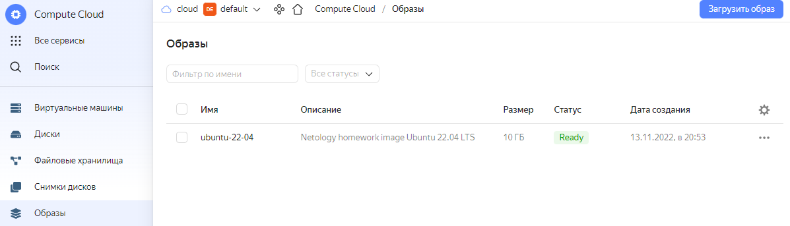
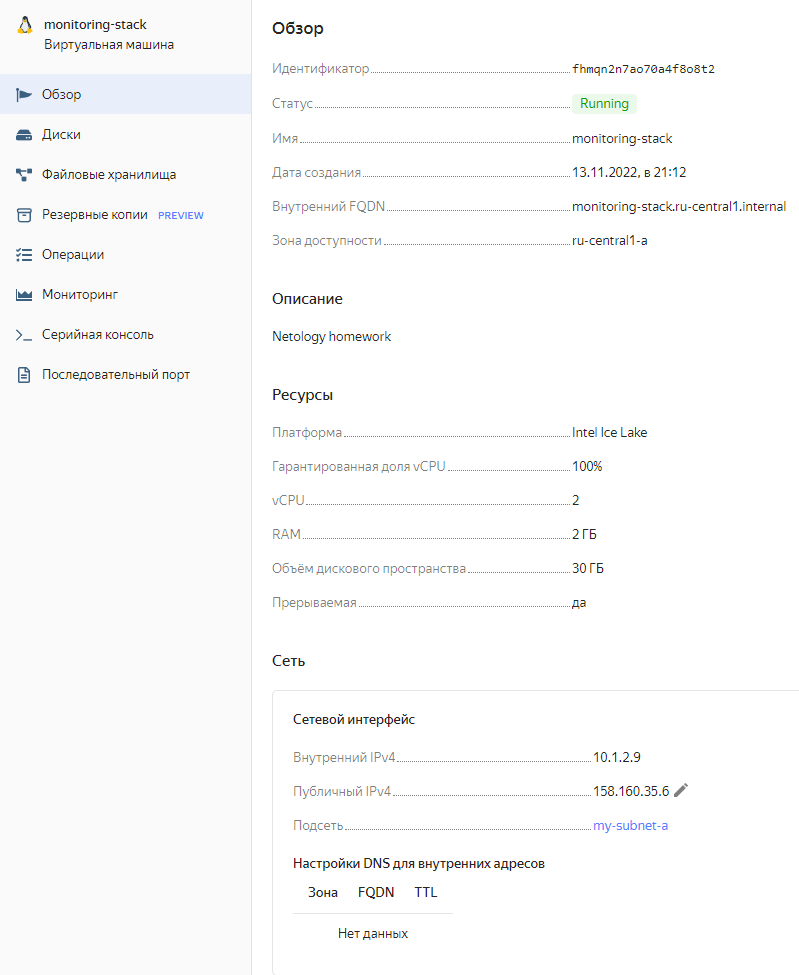

# 05-virt-04-docker-compose

## Задача 1

Создать собственный образ операционной системы с помощью Packer.

Для получения зачета, вам необходимо предоставить:
- Скриншот страницы, как на слайде из презентации (слайд 37).

>  В презентации всего 36 слайдов, так что попробую догадаться о чем идет речь. Образа centos-8 в Яндексе почему-то теперь нет, так что сделал с Ubuntu. Переменные и токен запрятал env.
> ### ubuntu2204.json
> ```json
> {
>     "builders": [
>       {
>         "type": "yandex",
>         "folder_id": "{{ user `YC_FOLDER` }}",
>         "token": "{{ user `YC_TOKEN` }}",
>         "zone": "{{ user `YC_ZONE` }}",
>         "image_name": "ubuntu-22-04",
>         "image_family": "my-images",
>         "image_description": "Netology homework image Ubuntu 22.04 LTS",
>         "source_image_family": "ubuntu-2204-lts",
>         "subnet_id": "{{ user `YC_SUBNET_ID` }}",
>         "use_ipv4_nat": true,
>         "disk_type": "network-ssd",
>         "ssh_username": "ubuntu"
>       }
>     ]
> }
> ```
>

## Задача 2

Создать вашу первую виртуальную машину в Яндекс.Облаке.

Для получения зачета, вам необходимо предоставить:
- Скриншот страницы свойств созданной ВМ, как на примере ниже:

<p align="center">
  
</p>

>

## Задача 3

Создать ваш первый готовый к боевой эксплуатации компонент мониторинга, состоящий из стека микросервисов.

Для получения зачета, вам необходимо предоставить:
- Скриншот работающего веб-интерфейса Grafana с текущими метриками, как на примере ниже
<p align="center">
  
</p>

>

## Задача 4 (*)

Создать вторую ВМ и подключить её к мониторингу развёрнутому на первом сервере.

Для получения зачета, вам необходимо предоставить:
- Скриншот из Grafana, на котором будут отображаться метрики добавленного вами сервера.
>
>