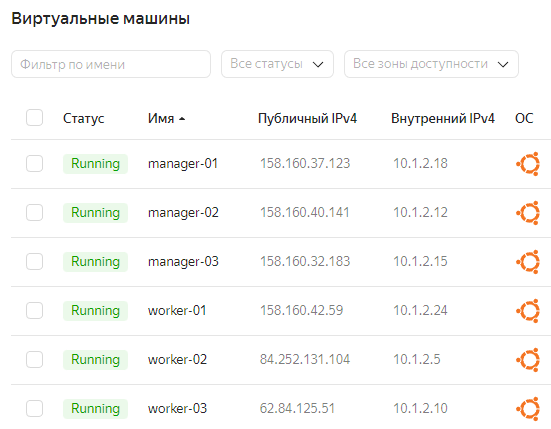
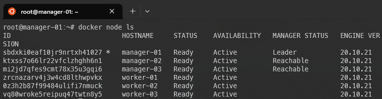
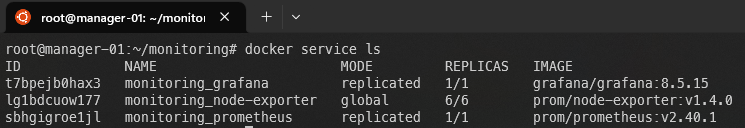

# 05-virt-05-docker-swarm

## Задача 1

Дайте письменые ответы на следующие вопросы:

- В чём отличие режимов работы сервисов в Docker Swarm кластере: replication и global?
    > global - запуск на всех нодах (например, node-exporter в моём стеке ниже), replication - запуск на необходимых нодах
- Какой алгоритм выбора лидера используется в Docker Swarm кластере?
    > RAFT - алгоритм, позволяющий распределенным системам достигать консенсуса, чтобы определить наступило или нет какое-либо событие и в каком порядке события происходили. По сути это лог записей, которым управляет лидер и реплицирует его на на фолловеров. Описание механизма выбора с голосованием на временных отрезках, вероятно, будет избыточным для ответа.
- Что такое Overlay Network?
    > Распределенная сеть поверх кластера, позвоялющая контейнерам на разных нодах общаться друг с другом. 

## Задача 2

Создать ваш первый Docker Swarm кластер в Яндекс.Облаке

Для получения зачета, вам необходимо предоставить скриншот из терминала (консоли), с выводом команды:
```
docker node ls
```


## Задача 3

Создать ваш первый, готовый к боевой эксплуатации кластер мониторинга, состоящий из стека микросервисов.

Для получения зачета, вам необходимо предоставить скриншот из терминала (консоли), с выводом команды:
```
docker service ls
```

## Задача 4 (*)

Выполнить на лидере Docker Swarm кластера команду (указанную ниже) и дать письменное описание её функционала, что она делает и зачем она нужна:
```
# см.документацию: https://docs.docker.com/engine/swarm/swarm_manager_locking/
docker swarm update --autolock=true
```
>Логи выбора лидера (как и трафик между нодами) шифруются для обеспечения безопасности. Ключи шифрования логов и трафика при перезапуске докера сохраняются в память менеджеров. Включение блока позволяет сгенерировать ключи и заблокировать менеджеры после перезагрузки до тех пор, пока не будет введен ключ, полученный ранее.