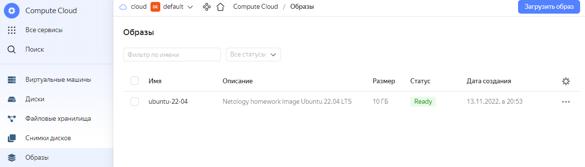
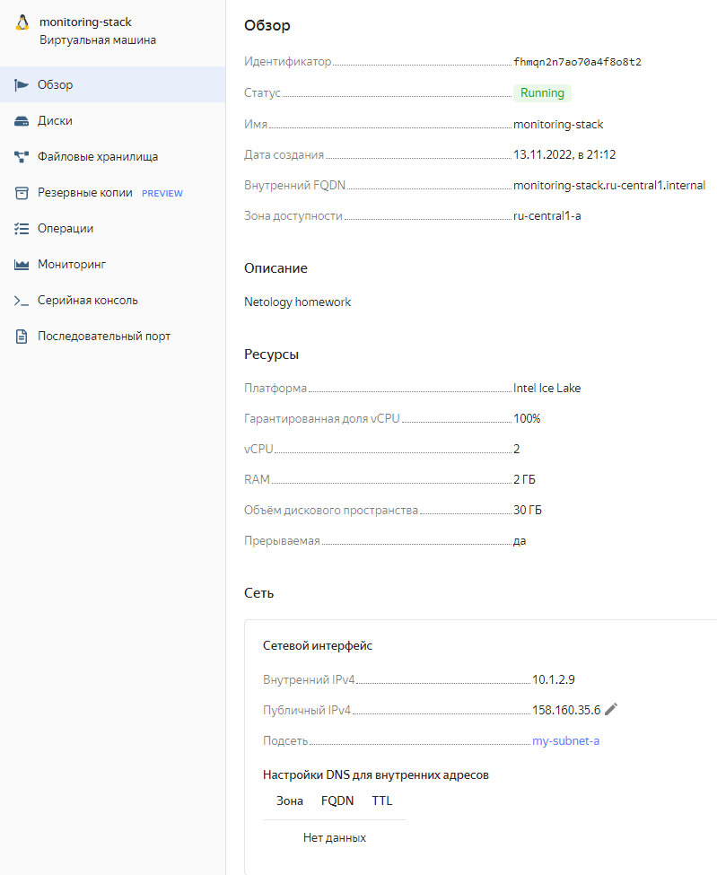
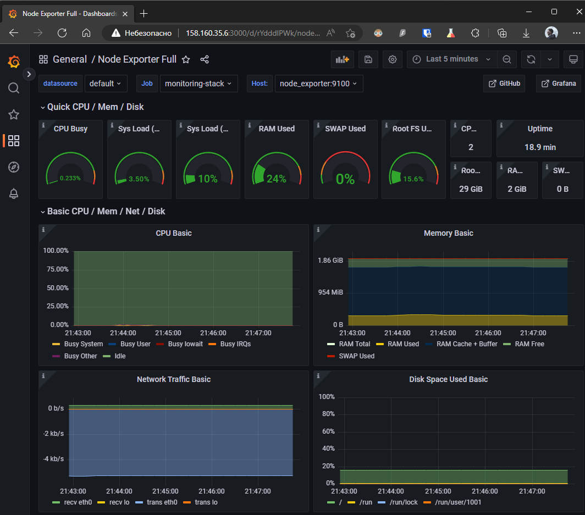
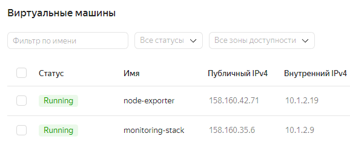
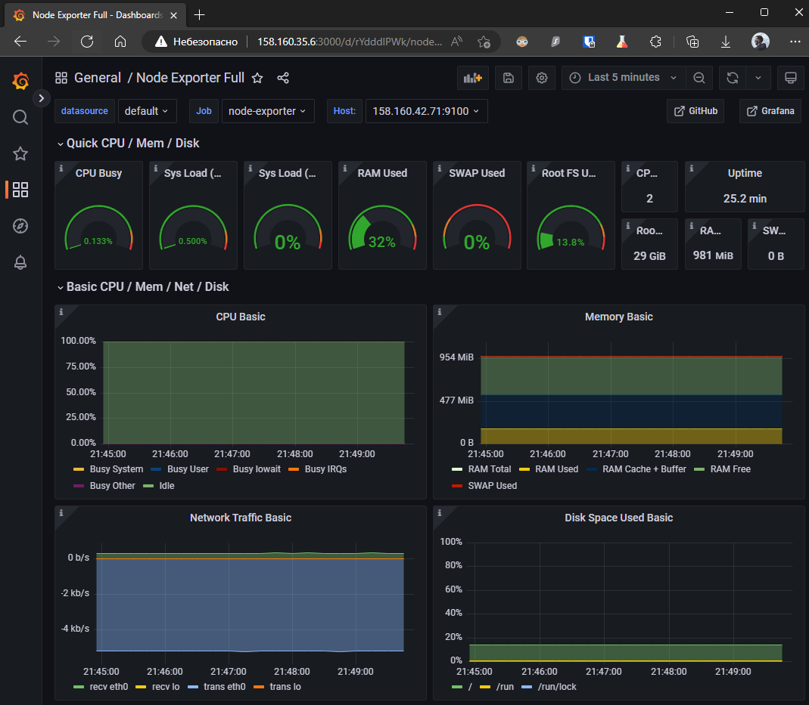

# Оглавление
* [05-virt-01-basics](#05-virt-01-basics)
* [05-virt-02-iaac](#05-virt-02-iaac)
* [05-virt-03-docker](#05-virt-03-docker)
* [05-virt-04-docker-compose](#05-virt-04-docker-compose)
* [05-virt-05-docker-swarm](#05-virt-05-docker-swarm)
---

# 05-virt-01-basics

## Задача 1

Опишите кратко, как вы поняли: в чем основное отличие полной (аппаратной) виртуализации, паравиртуализации и виртуализации на основе ОС.

> Паравиртуализация требует наличия ОС для доступа к "железу" и необходима модификация ядра гостевых ОС (KVM, Hyper-V). Полная виртуализация позволяет запускать виртуальные среды минуя ОС гипервизора, гостевые процессы сразу выполняются на процессоре (ESXi, Hyper-V, Xev). Виртуализация на ОС - оно же контейнеризация. Контейнеры используют то же ядро, что и родительская система.

## Задача 2

Выберите один из вариантов использования организации физических серверов, в зависимости от условий использования.

Организация серверов:
- физические сервера,
- паравиртуализация,
- виртуализация уровня ОС.

Условия использования:
- Высоконагруженная база данных, чувствительная к отказу.
    > Физические серверы, БД кластеризована. Минимум прослоек между ПО и оборудованием, минимум прочих переменных, которые могут оказать какое-либо незапланированное влияние. Упрощается диагностика и оптимизация для достижения максимальной производительности и минимального времени отклика.
- Различные web-приложения.
    > Контейнеры. Простота и скорость развертывания. Масштабирование под нагрузку.
- Windows системы для использования бухгалтерским отделом.
    > Паравиртуализация. Не требуется гонка за время отклика, упрощается управление ресурсами ОС при их нехватке. Простой и достаточно быстрый бекап.
- Системы, выполняющие высокопроизводительные расчеты на GPU.
    > Паравиртуализация + проброс PCI устройств в гостевую ОС. Удобство управления ВМ и скорость прямой работы с PCI устройством.

Опишите, почему вы выбрали к каждому целевому использованию такую организацию.

## Задача 3

Выберите подходящую систему управления виртуализацией для предложенного сценария. Детально опишите ваш выбор.

Сценарии:

1. 100 виртуальных машин на базе Linux и Windows, общие задачи, нет особых требований. Преимущественно Windows based инфраструктура, требуется реализация программных балансировщиков нагрузки, репликации данных и автоматизированного механизма создания резервных копий.
    > Бесплатное (без подписки на энтерпрайз репо) и хорошо работющее решение - Proxmox. Отлично работает с Windows гостями (включая cloud-init). Балансировщики нагрузки могут быть как в виде LXC, так и такими же виртуалками. Имеет встроенный планировщик полного резервного копирования, расширяемый функционалом инкрементального копирования засчет внешенего Proxmox Backup Server. Можно использовать OpenNebula, но с ним придется поплясать.
2. Требуется наиболее производительное бесплатное open source решение для виртуализации небольшой (20-30 серверов) инфраструктуры на базе Linux и Windows виртуальных машин.
    > То же самое, Proxmox.
3. Необходимо бесплатное, максимально совместимое и производительное решение для виртуализации Windows инфраструктуры.
    > Если есть деньги - VMware. Если денег нет - Proxmox. Если есть виндовые сисадмины и тяга к приключениям - Hyper-V.
4. Необходимо рабочее окружение для тестирования программного продукта на нескольких дистрибутивах Linux.
    > И опять Proxmox/OpenNebula.

## Задача 4

Опишите возможные проблемы и недостатки гетерогенной среды виртуализации (использования нескольких систем управления виртуализацией одновременно) и что необходимо сделать для минимизации этих рисков и проблем. Если бы у вас был выбор, то создавали бы вы гетерогенную среду или нет? Мотивируйте ваш ответ примерами.

> Гетерогенные среды усложняют управление, увеличивают потребность в специалистах различного профиля. В большинстве случаев можно избежать проблем и не устраивать зоопарк, но если потребность всё-таки возникакет - можно использовать специализированные решения для гибридных сред.

# 05-virt-02-iaac

## Задача 1

- Опишите своими словами основные преимущества применения на практике IaaC паттернов.
    > - Подготока шаблонов ускорояет развертывание 
    > - Однородность конфигураций
    > - Ускорение и упрощение жизни разработчиков
- Какой из принципов IaaC является основополагающим?
    > Разработка инфраструктуры идентична разработке кода.

## Задача 2

- Чем Ansible выгодно отличается от других систем управление конфигурациями?
    > Низкий порог входа, требует знания достаточно популярного и простого языка Python. Не требует наличия агентов на хостах.
- Какой, на ваш взгляд, метод работы систем конфигурации более надёжный push или pull?
    > push надежнее, всегда можно быть уверенным, что конфигурация "доехала" (или нет) до конечного хоста.
    

## Задача 3

Установить на личный компьютер:

- VirtualBox
- Vagrant
- Ansible

*Приложить вывод команд установленных версий каждой из программ, оформленный в markdown.*

```bash
❯ vboxmanage --version
6.1.38_Ubuntur153438
❯ vagrant --version
Vagrant 2.3.2
❯ ansible --version
ansible [core 2.13.6]
  config file = /etc/ansible/ansible.cfg
  configured module search path = ['/root/.ansible/plugins/modules', '/usr/share/ansible/plugins/modules']
  ansible python module location = /usr/lib/python3/dist-packages/ansible
  ansible collection location = /root/.ansible/collections:/usr/share/ansible/collections
  executable location = /usr/bin/ansible
  python version = 3.10.6 (main, Nov  2 2022, 18:53:38) [GCC 11.3.0]
  jinja version = 3.0.3
  libyaml = True
```


## Задача 4 (*)

Воспроизвести практическую часть лекции самостоятельно.

- Создать виртуальную машину.
- Зайти внутрь ВМ, убедиться, что Docker установлен с помощью команды
```
docker ps
```
> Done

# 05-virt-03-docker

## Задача 1

Сценарий выполения задачи:

- создайте свой репозиторий на https://hub.docker.com;
- выберете любой образ, который содержит веб-сервер Nginx;
- создайте свой fork образа;
- реализуйте функциональность:
запуск веб-сервера в фоне с индекс-страницей, содержащей HTML-код ниже:
```
<html>
<head>
Hey, Netology
</head>
<body>
<h1>I’m DevOps Engineer!</h1>
</body>
</html>
```
Опубликуйте созданный форк в своем репозитории и предоставьте ответ в виде ссылки на https://hub.docker.com/username_repo.

[
](https://hub.docker.com/r/dexogen/nginx)

## Задача 2

Посмотрите на сценарий ниже и ответьте на вопрос:
"Подходит ли в этом сценарии использование Docker контейнеров или лучше подойдет виртуальная машина, физическая машина? Может быть возможны разные варианты?"

Детально опишите и обоснуйте свой выбор.

Сценарий:

- Высоконагруженное монолитное java веб-приложение;
    > 
- Nodejs веб-приложение;
    > Отлично собирается и упаковывается в контейнер. Докер и K8s уже ждут образ.
- Мобильное приложение c версиями для Android и iOS;
    > Если PWA, то вполне можно обойтись и контейнером для тестирования неспецифического для конечного устройства функционала. Для всего остального потребуется виртуализация.
- Шина данных на базе Apache Kafka;
    > Кафка с зукипером вполне неплохо себя чувствуют в контейнере и без. Нет каких-то явных проблем для их использования в любой среде.
- Elasticsearch кластер для реализации логирования продуктивного веб-приложения - три ноды elasticsearch, два logstash и две ноды kibana;
    > Для боевой среды с высокой нагрузкой я предпочел бы виртуальные машины. Для тестовой вполне подойдут контейнеры.
- Мониторинг-стек на базе Prometheus и Grafana;
    > Контейнеры. Прекрасно себя чувствует в docker и K8s. 
- MongoDB, как основное хранилище данных для java-приложения;
    > Для боевых баз данных я предпочитаю использовать физику. Чем меньше переменных в инсталляции, тем проще ее поддерживать и дебажить.
- Gitlab сервер для реализации CI/CD процессов и приватный (закрытый) Docker Registry.
    > Контейнеры. По опыту GitLab в контейнере + Elasticsearch + Registry прекрасно себя чувствуют в нагруженной среде и 30 разработчиках.

## Задача 3

- Запустите первый контейнер из образа ***centos*** c любым тэгом в фоновом режиме, подключив папку ```/data``` из текущей рабочей директории на хостовой машине в ```/data``` контейнера;
- Запустите второй контейнер из образа ***debian*** в фоновом режиме, подключив папку ```/data``` из текущей рабочей директории на хостовой машине в ```/data``` контейнера;
- Подключитесь к первому контейнеру с помощью ```docker exec``` и создайте текстовый файл любого содержания в ```/data```;
- Добавьте еще один файл в папку ```/data``` на хостовой машине;
- Подключитесь во второй контейнер и отобразите листинг и содержание файлов в ```/data``` контейнера.

```bash
❯ docker run -it -d -v ~/data/:/data --name centos centos
❯ docker run -it -d -v ~/data/:/data --name debian debian
❯ docker exec -it centos bash
[root@a937ae53790a /]# echo "It Is Wednesday" > /data/my.dudes
❯ echo "Feels good man" > data/sad.pepe
❯ docker exec -it debian bash
root@25716be3ff0d:/# ls /data/
my.dudes  sad.pepe
```

## Задача 4 (*)

Воспроизвести практическую часть лекции самостоятельно.

Соберите Docker образ с Ansible, загрузите на Docker Hub и пришлите ссылку вместе с остальными ответами к задачам.

> Решил собрать всё-таки версию более свежую 6.6.0 на alpine 3.16.2.
>[
](https://hub.docker.com/r/dexogen/ansible)

# 05-virt-04-docker-compose

## Задача 1

Создать собственный образ операционной системы с помощью Packer.

Для получения зачета, вам необходимо предоставить:
- Скриншот страницы, как на слайде из презентации (слайд 37).

>  В презентации всего 36 слайдов, так что попробую догадаться о чем идет речь. Образа centos-8 в Яндексе почему-то теперь нет, так что сделал с Ubuntu. Переменные и токен запрятал env.
> ### ubuntu2204.json
> ```json
> {
>     "builders": [
>       {
>         "type": "yandex",
>         "folder_id": "{{ user `YC_FOLDER` }}",
>         "token": "{{ user `YC_TOKEN` }}",
>         "zone": "{{ user `YC_ZONE` }}",
>         "image_name": "ubuntu-22-04",
>         "image_family": "my-images",
>         "image_description": "Netology homework image Ubuntu 22.04 LTS",
>         "source_image_family": "ubuntu-2204-lts",
>         "subnet_id": "{{ user `YC_SUBNET_ID` }}",
>         "use_ipv4_nat": true,
>         "disk_type": "network-ssd",
>         "ssh_username": "ubuntu"
>       }
>     ]
> }
> ```
>

## Задача 2

Создать вашу первую виртуальную машину в Яндекс.Облаке.

Для получения зачета, вам необходимо предоставить:
- Скриншот страницы свойств созданной ВМ, как на примере ниже:

<p align="center">
  
</p>

>

## Задача 3

Создать ваш первый готовый к боевой эксплуатации компонент мониторинга, состоящий из стека микросервисов.

Для получения зачета, вам необходимо предоставить:
- Скриншот работающего веб-интерфейса Grafana с текущими метриками, как на примере ниже
<p align="center">
  
</p>

>

## Задача 4 (*)

Создать вторую ВМ и подключить её к мониторингу развёрнутому на первом сервере.

Для получения зачета, вам необходимо предоставить:
- Скриншот из Grafana, на котором будут отображаться метрики добавленного вами сервера.
>
>
# 05-virt-05-docker-swarm
